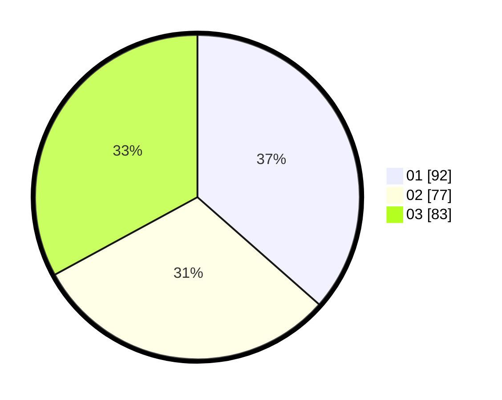

# Hasil

Hasil perolehan suara paslon dapat dilihat pada file paslon-01.txt, paslon-02.txt, dan paslon-03.txt.

Jika tidak ada, artinya data tersebut belum ada pada SIREKAP.

## Perolehan Suara

 * Paslon 01: **92**.
 * Paslon 02: **77**.
 * Paslon 03: **83**.

## Foto C Plano

https://sirekap-obj-formc.kpu.go.id/1b12/pemilu/ppwp/31/71/05/10/01/3171051001068-20240215-012329--f76b0512-a6ea-4732-aa29-bffcd5cb4996.jpg

https://sirekap-obj-formc.kpu.go.id/1b12/pemilu/ppwp/31/71/05/10/01/3171051001068-20240215-012644--f71768e5-3e8d-4df6-aaea-052a97dde6e0.jpg
