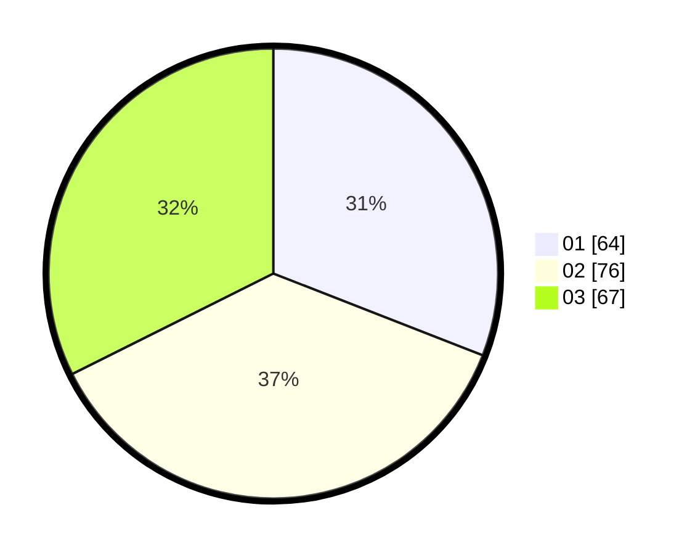

# Hasil

Hasil perolehan suara paslon dapat dilihat pada file paslon-01.txt, paslon-02.txt, dan paslon-03.txt.

Jika tidak ada, artinya data tersebut belum ada pada SIREKAP.

## Perolehan Suara

 * Paslon 01: **64**.
 * Paslon 02: **76**.
 * Paslon 03: **67**.

## Foto C Plano

https://sirekap-obj-formc.kpu.go.id/76bc/pemilu/ppwp/31/71/05/10/01/3171051001072-20240214-155259--1281456c-e42b-4958-b04d-574ba63a25ec.jpg

https://sirekap-obj-formc.kpu.go.id/76bc/pemilu/ppwp/31/71/05/10/01/3171051001072-20240214-230309--28204a01-9d3e-4542-bd00-3e48556b56e6.jpg

https://sirekap-obj-formc.kpu.go.id/76bc/pemilu/ppwp/31/71/05/10/01/3171051001072-20240214-155446--c5709e78-2a86-4912-a526-443b7def1b20.jpg

## DATA PEMILIH TETAP

Jumlah pemilih dalam DPT: **267**.
 * L: **123**.
 * P: **144**.

## DATA PENGGUNA HAK PILIH

Jumlah pengguna hak pilih dalam DPT: **190**.
 * L: **78**.
 * P: **112**.

Jumlah pengguna hak pilih dalam DPTb: **10**.
 * L: **5**.
 * P: **5**.

Jumlah pengguna hak pilih dalam DPK: **9**.
 * L: **6**.
 * P: **3**.

Jumlah pengguna hak pilih: **209**.
 * L: **89**.
 * P: **120**.

## JUMLAH SUARA SAH DAN TIDAK SAH

JUMLAH SELURUH SUARA SAH: **207**.

JUMLAH SUARA TIDAK SAH: **2**.

JUMLAH SELURUH SUARA SAH DAN SUARA TIDAK SAH: **209**.
