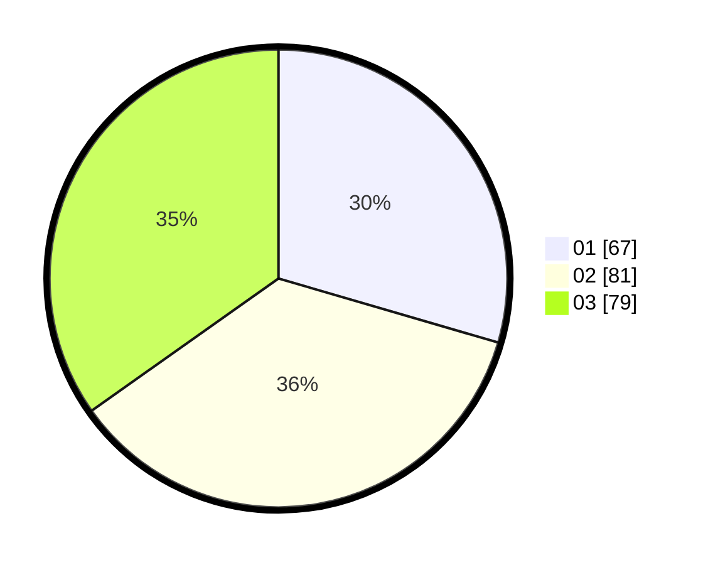

# Hasil

Hasil perolehan suara paslon dapat dilihat pada file paslon-01.txt, paslon-02.txt, dan paslon-03.txt.

Jika tidak ada, artinya data tersebut belum ada pada SIREKAP.

## Perolehan Suara

 * Paslon 01: **67**.
 * Paslon 02: **81**.
 * Paslon 03: **79**.

## Foto C Plano

https://sirekap-obj-formc.kpu.go.id/acb9/pemilu/ppwp/31/71/05/10/01/3171051001074-20240214-185617--caa1ae08-fd56-4f56-8d92-73ee6fb280e1.jpg

https://sirekap-obj-formc.kpu.go.id/acb9/pemilu/ppwp/31/71/05/10/01/3171051001074-20240214-185055--830fcd55-91b6-4271-9942-d63ef63bac98.jpg

https://sirekap-obj-formc.kpu.go.id/acb9/pemilu/ppwp/31/71/05/10/01/3171051001074-20240214-185354--12e657ee-8ba0-4e53-8927-6729066fa0bb.jpg

## DATA PEMILIH TETAP

Jumlah pemilih dalam DPT: **274**.
 * L: **135**.
 * P: **139**.

## DATA PENGGUNA HAK PILIH

Jumlah pengguna hak pilih dalam DPT: **209**.
 * L: **96**.
 * P: **113**.

Jumlah pengguna hak pilih dalam DPTb: **10**.
 * L: **4**.
 * P: **6**.

Jumlah pengguna hak pilih dalam DPK: **9**.
 * L: **3**.
 * P: **6**.

Jumlah pengguna hak pilih: **228**.
 * L: **103**.
 * P: **125**.

## JUMLAH SUARA SAH DAN TIDAK SAH

JUMLAH SELURUH SUARA SAH: **227**.

JUMLAH SUARA TIDAK SAH: **1**.

JUMLAH SELURUH SUARA SAH DAN SUARA TIDAK SAH: **228**.
