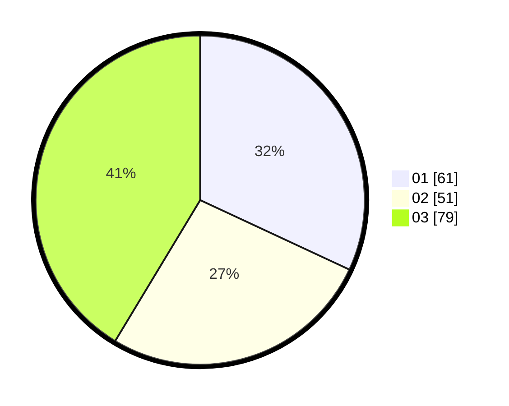

# Hasil

Hasil perolehan suara paslon dapat dilihat pada file paslon-01.txt, paslon-02.txt, dan paslon-03.txt.

Jika tidak ada, artinya data tersebut belum ada pada SIREKAP.

## Perolehan Suara

 * Paslon 01: **61**.
 * Paslon 02: **51**.
 * Paslon 03: **79**.

## Foto C Plano

https://sirekap-obj-formc.kpu.go.id/40e0/pemilu/ppwp/31/71/05/10/01/3171051001075-20240215-224434--ffb603f9-3fde-42e4-ac52-54cd70c171a6.jpg

https://sirekap-obj-formc.kpu.go.id/40e0/pemilu/ppwp/31/71/05/10/01/3171051001075-20240215-224437--b9d39419-f631-403a-acbb-771e999689b0.jpg

https://sirekap-obj-formc.kpu.go.id/40e0/pemilu/ppwp/31/71/05/10/01/3171051001075-20240215-224436--9d9e770c-9765-47ee-8189-a4919e672102.jpg

## DATA PEMILIH TETAP

Jumlah pemilih dalam DPT: **276**.
 * L: **123**.
 * P: **153**.

## DATA PENGGUNA HAK PILIH

Jumlah pengguna hak pilih dalam DPT: **188**.
 * L: **90**.
 * P: **98**.

Jumlah pengguna hak pilih dalam DPTb: **3**.
 * L: **2**.
 * P: **1**.

Jumlah pengguna hak pilih dalam DPK: **2**.
 * L: **1**.
 * P: **1**.

Jumlah pengguna hak pilih: **193**.
 * L: **93**.
 * P: **100**.

## JUMLAH SUARA SAH DAN TIDAK SAH

JUMLAH SELURUH SUARA SAH: **191**.

JUMLAH SUARA TIDAK SAH: **2**.

JUMLAH SELURUH SUARA SAH DAN SUARA TIDAK SAH: **193**.
