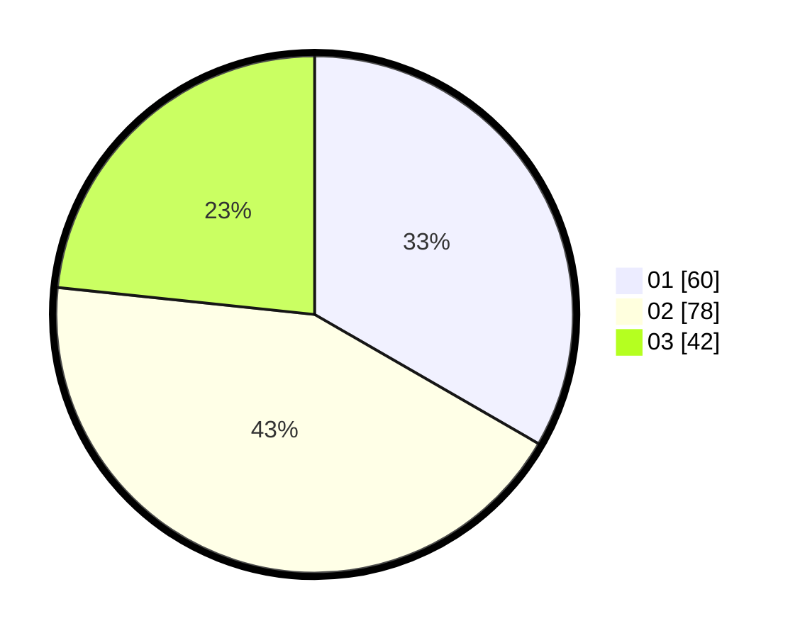

# Hasil

Hasil perolehan suara paslon dapat dilihat pada file paslon-01.txt, paslon-02.txt, dan paslon-03.txt.

Jika tidak ada, artinya data tersebut belum ada pada SIREKAP.

## Perolehan Suara

 * Paslon 01: **60**.
 * Paslon 02: **78**.
 * Paslon 03: **42**.

## Foto C Plano

https://sirekap-obj-formc.kpu.go.id/512f/pemilu/ppwp/31/71/05/10/01/3171051001076-20240214-190835--7f6ba437-4dff-4ab5-8de8-cfdffa056462.jpg

https://sirekap-obj-formc.kpu.go.id/512f/pemilu/ppwp/31/71/05/10/01/3171051001076-20240216-090302--92e672ff-fd7b-49bc-a16f-ea41468acebe.jpg

https://sirekap-obj-formc.kpu.go.id/512f/pemilu/ppwp/31/71/05/10/01/3171051001076-20240214-190936--67f67b94-7186-4934-9d31-e3a2a1caafb3.jpg

## DATA PEMILIH TETAP

Jumlah pemilih dalam DPT: **256**.
 * L: **122**.
 * P: **134**.

## DATA PENGGUNA HAK PILIH

Jumlah pengguna hak pilih dalam DPT: **175**.
 * L: **81**.
 * P: **94**.

Jumlah pengguna hak pilih dalam DPTb: **10**.
 * L: **6**.
 * P: **4**.

Jumlah pengguna hak pilih dalam DPK: **1**.
 * L: **1**.
 * P: **0**.

Jumlah pengguna hak pilih: **186**.
 * L: **88**.
 * P: **98**.

## JUMLAH SUARA SAH DAN TIDAK SAH

JUMLAH SELURUH SUARA SAH: **180**.

JUMLAH SUARA TIDAK SAH: **6**.

JUMLAH SELURUH SUARA SAH DAN SUARA TIDAK SAH: **186**.
