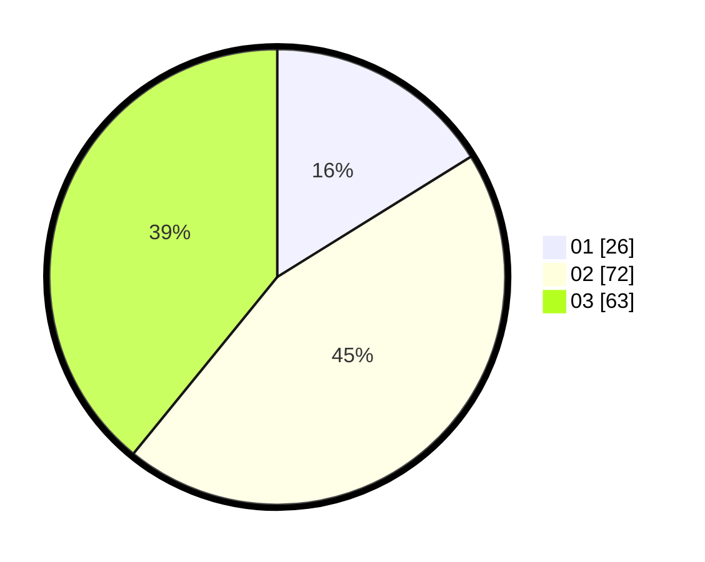

# Hasil

Hasil perolehan suara paslon dapat dilihat pada file paslon-01.txt, paslon-02.txt, dan paslon-03.txt.

Jika tidak ada, artinya data tersebut belum ada pada SIREKAP.

## Perolehan Suara

 * Paslon 01: **26**.
 * Paslon 02: **72**.
 * Paslon 03: **63**.

## Foto C Plano

https://sirekap-obj-formc.kpu.go.id/b1c9/pemilu/ppwp/31/71/05/10/01/3171051001077-20240215-075657--900d539f-fcb5-409c-a778-aedfa925372e.jpg

https://sirekap-obj-formc.kpu.go.id/b1c9/pemilu/ppwp/31/71/05/10/01/3171051001077-20240215-075722--fde4de2f-fa8f-4fc2-8fa2-504944fe572a.jpg

https://sirekap-obj-formc.kpu.go.id/b1c9/pemilu/ppwp/31/71/05/10/01/3171051001077-20240215-075711--49868b9f-370a-44a2-b73a-3417c1bad980.jpg

## DATA PEMILIH TETAP

Jumlah pemilih dalam DPT: **243**.
 * L: **120**.
 * P: **123**.

## DATA PENGGUNA HAK PILIH

Jumlah pengguna hak pilih dalam DPT: **153**.
 * L: **72**.
 * P: **81**.

Jumlah pengguna hak pilih dalam DPTb: **6**.
 * L: **3**.
 * P: **3**.

Jumlah pengguna hak pilih dalam DPK: **4**.
 * L: **1**.
 * P: **3**.

Jumlah pengguna hak pilih: **163**.
 * L: **76**.
 * P: **87**.

## JUMLAH SUARA SAH DAN TIDAK SAH

JUMLAH SELURUH SUARA SAH: **161**.

JUMLAH SUARA TIDAK SAH: **2**.

JUMLAH SELURUH SUARA SAH DAN SUARA TIDAK SAH: **163**.
