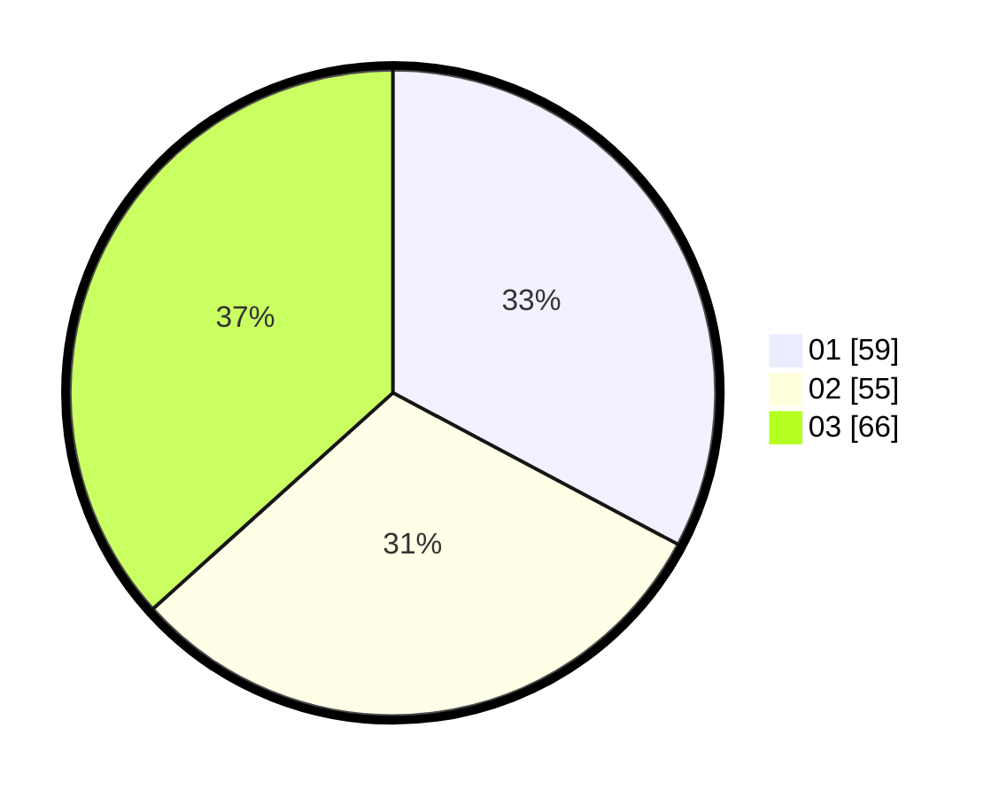

# Hasil

Hasil perolehan suara paslon dapat dilihat pada file paslon-01.txt, paslon-02.txt, dan paslon-03.txt.

Jika tidak ada, artinya data tersebut belum ada pada SIREKAP.

## Perolehan Suara

 * Paslon 01: **59**.
 * Paslon 02: **55**.
 * Paslon 03: **66**.

## Foto C Plano

https://sirekap-obj-formc.kpu.go.id/0172/pemilu/ppwp/31/71/05/10/01/3171051001079-20240216-143242--519f8961-eb24-49d3-8388-60469b9d0ea2.jpg

https://sirekap-obj-formc.kpu.go.id/0172/pemilu/ppwp/31/71/05/10/01/3171051001079-20240216-143243--b0ed05ab-bbac-4661-bd0d-e907bdd27af7.jpg

https://sirekap-obj-formc.kpu.go.id/0172/pemilu/ppwp/31/71/05/10/01/3171051001079-20240216-143243--97baad91-4e00-41cc-9b4c-e02b250e53c7.jpg

## DATA PEMILIH TETAP

Jumlah pemilih dalam DPT: **245**.
 * L: **112**.
 * P: **133**.

## DATA PENGGUNA HAK PILIH

Jumlah pengguna hak pilih dalam DPT: **166**.
 * L: **78**.
 * P: **88**.

Jumlah pengguna hak pilih dalam DPTb: **8**.
 * L: **3**.
 * P: **5**.

Jumlah pengguna hak pilih dalam DPK: **9**.
 * L: **5**.
 * P: **4**.

Jumlah pengguna hak pilih: **183**.
 * L: **86**.
 * P: **97**.

## JUMLAH SUARA SAH DAN TIDAK SAH

JUMLAH SELURUH SUARA SAH: **180**.

JUMLAH SUARA TIDAK SAH: **3**.

JUMLAH SELURUH SUARA SAH DAN SUARA TIDAK SAH: **183**.
