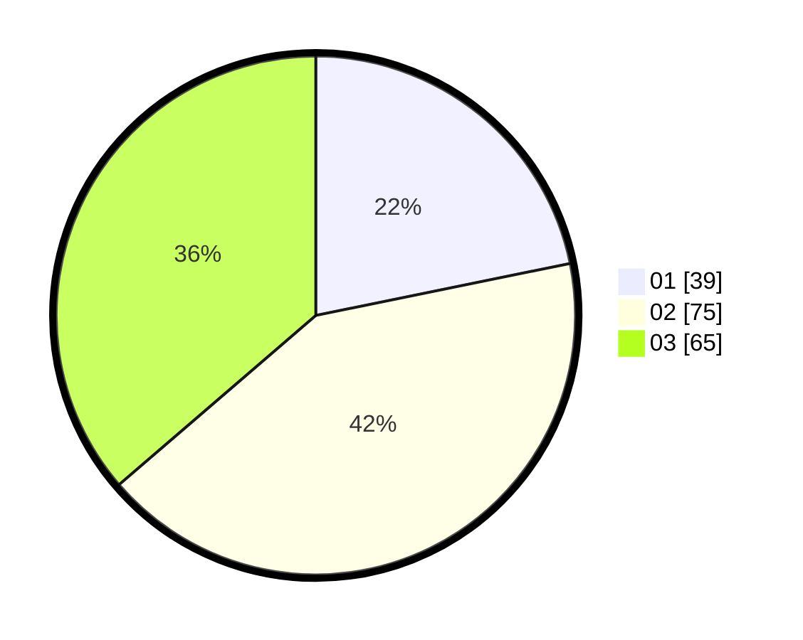

# Hasil

Hasil perolehan suara paslon dapat dilihat pada file paslon-01.txt, paslon-02.txt, dan paslon-03.txt.

Jika tidak ada, artinya data tersebut belum ada pada SIREKAP.

## Perolehan Suara

 * Paslon 01: **39**.
 * Paslon 02: **75**.
 * Paslon 03: **65**.

## Foto C Plano

https://sirekap-obj-formc.kpu.go.id/763d/pemilu/ppwp/31/71/05/10/01/3171051001080-20240216-140103--63d64208-59a7-4694-8fa2-5ebcc8109c22.jpg

https://sirekap-obj-formc.kpu.go.id/763d/pemilu/ppwp/31/71/05/10/01/3171051001080-20240216-140104--f2543049-7868-4183-9fea-76a659f8b031.jpg

https://sirekap-obj-formc.kpu.go.id/763d/pemilu/ppwp/31/71/05/10/01/3171051001080-20240216-140103--f69e2a4c-65c1-4db2-9a6b-b36fe677cdc1.jpg

## DATA PEMILIH TETAP

Jumlah pemilih dalam DPT: **247**.
 * L: **120**.
 * P: **127**.

## DATA PENGGUNA HAK PILIH

Jumlah pengguna hak pilih dalam DPT: **161**.
 * L: **76**.
 * P: **85**.

Jumlah pengguna hak pilih dalam DPTb: **6**.
 * L: **2**.
 * P: **4**.

Jumlah pengguna hak pilih dalam DPK: **13**.
 * L: **5**.
 * P: **8**.

Jumlah pengguna hak pilih: **80**.
 * L: **83**.
 * P: **97**.

## JUMLAH SUARA SAH DAN TIDAK SAH

JUMLAH SELURUH SUARA SAH: **179**.

JUMLAH SUARA TIDAK SAH: **1**.

JUMLAH SELURUH SUARA SAH DAN SUARA TIDAK SAH: **180**.
