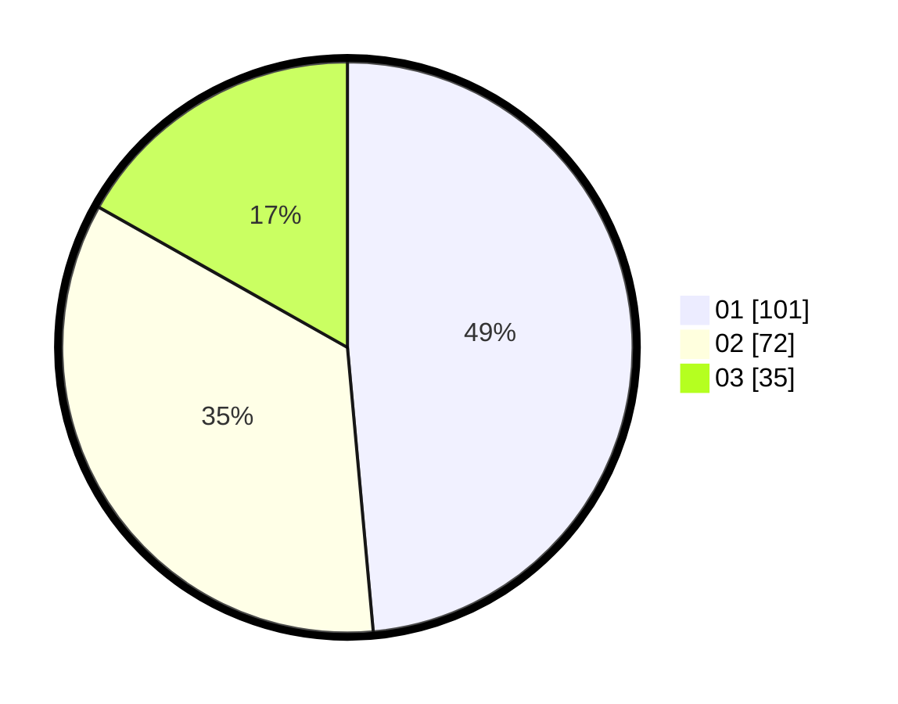

# Hasil

Hasil perolehan suara paslon dapat dilihat pada file paslon-01.txt, paslon-02.txt, dan paslon-03.txt.

Jika tidak ada, artinya data tersebut belum ada pada SIREKAP.

## Perolehan Suara

 * Paslon 01: **101**.
 * Paslon 02: **72**.
 * Paslon 03: **35**.

## Foto C Plano

https://sirekap-obj-formc.kpu.go.id/bf10/pemilu/ppwp/31/71/05/10/02/3171051002001-20240216-125119--0d56fe0d-5f50-45d4-991d-792b80aa8fa1.jpg

https://sirekap-obj-formc.kpu.go.id/bf10/pemilu/ppwp/31/71/05/10/02/3171051002001-20240216-125122--b943a4d9-8612-4d0b-b0a0-19989bc35ed5.jpg

https://sirekap-obj-formc.kpu.go.id/bf10/pemilu/ppwp/31/71/05/10/02/3171051002001-20240216-125121--efb5c5f2-6f9b-4bad-8c45-09789cf0751d.jpg

## DATA PEMILIH TETAP

Jumlah pemilih dalam DPT: **290**.
 * L: **152**.
 * P: **138**.

## DATA PENGGUNA HAK PILIH

Jumlah pengguna hak pilih dalam DPT: **200**.
 * L: **98**.
 * P: **102**.

Jumlah pengguna hak pilih dalam DPTb: **6**.
 * L: **4**.
 * P: **2**.

Jumlah pengguna hak pilih dalam DPK: **4**.
 * L: **1**.
 * P: **3**.

Jumlah pengguna hak pilih: **210**.
 * L: **103**.
 * P: **107**.

## JUMLAH SUARA SAH DAN TIDAK SAH

JUMLAH SELURUH SUARA SAH: **208**.

JUMLAH SUARA TIDAK SAH: **2**.

JUMLAH SELURUH SUARA SAH DAN SUARA TIDAK SAH: **210**.
