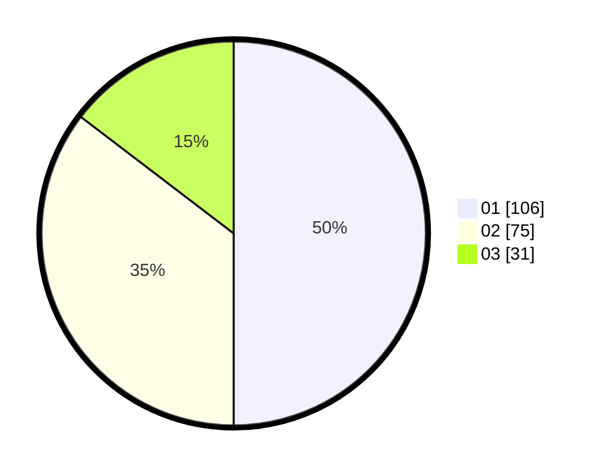

# Hasil

Hasil perolehan suara paslon dapat dilihat pada file paslon-01.txt, paslon-02.txt, dan paslon-03.txt.

Jika tidak ada, artinya data tersebut belum ada pada SIREKAP.

## Perolehan Suara

 * Paslon 01: **106**.
 * Paslon 02: **75**.
 * Paslon 03: **31**.

## Foto C Plano

https://sirekap-obj-formc.kpu.go.id/6d4d/pemilu/ppwp/31/71/05/10/02/3171051002008-20240216-031549--74688ad5-1501-446c-967c-332412076436.jpg

https://sirekap-obj-formc.kpu.go.id/6d4d/pemilu/ppwp/31/71/05/10/02/3171051002008-20240216-031552--7297dd99-4e90-4f02-97f4-282c1c22bedd.jpg

https://sirekap-obj-formc.kpu.go.id/6d4d/pemilu/ppwp/31/71/05/10/02/3171051002008-20240216-031550--0fc3f85f-6f20-4f6d-9aff-d7a635dbd8b4.jpg

## DATA PEMILIH TETAP

Jumlah pemilih dalam DPT: **274**.
 * L: **148**.
 * P: **126**.

## DATA PENGGUNA HAK PILIH

Jumlah pengguna hak pilih dalam DPT: **211**.
 * L: **110**.
 * P: **101**.

Jumlah pengguna hak pilih dalam DPTb: **2**.
 * L: **0**.
 * P: **2**.

Jumlah pengguna hak pilih dalam DPK: **0**.
 * L: **0**.
 * P: **0**.

Jumlah pengguna hak pilih: **213**.
 * L: **110**.
 * P: **103**.

## JUMLAH SUARA SAH DAN TIDAK SAH

JUMLAH SELURUH SUARA SAH: **212**.

JUMLAH SUARA TIDAK SAH: **1**.

JUMLAH SELURUH SUARA SAH DAN SUARA TIDAK SAH: **213**.
