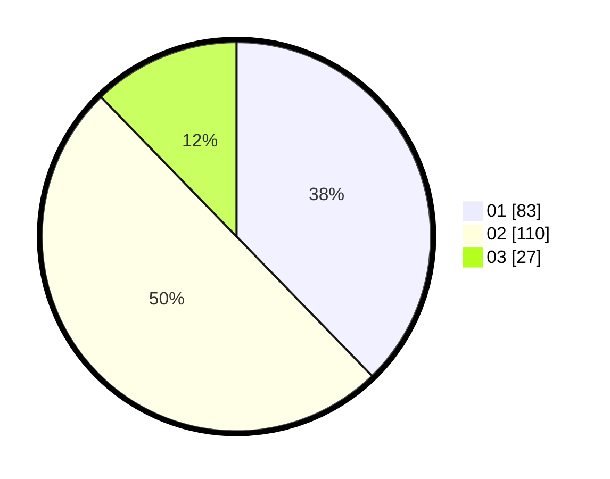

# Hasil

Hasil perolehan suara paslon dapat dilihat pada file paslon-01.txt, paslon-02.txt, dan paslon-03.txt.

Jika tidak ada, artinya data tersebut belum ada pada SIREKAP.

## Perolehan Suara

 * Paslon 01: **83**.
 * Paslon 02: **110**.
 * Paslon 03: **27**.

## Foto C Plano

https://sirekap-obj-formc.kpu.go.id/a955/pemilu/ppwp/31/71/05/10/02/3171051002009-20240215-185736--74b6cc2d-e527-4013-ae13-6a846008ff60.jpg

https://sirekap-obj-formc.kpu.go.id/a955/pemilu/ppwp/31/71/05/10/02/3171051002009-20240215-205711--2af78c24-f250-4eaf-bfe0-c73ea57f4590.jpg

https://sirekap-obj-formc.kpu.go.id/a955/pemilu/ppwp/31/71/05/10/02/3171051002009-20240215-205655--b32a9f52-6c2d-40d7-8b2d-1e7d43f9f4e5.jpg

## DATA PEMILIH TETAP

Jumlah pemilih dalam DPT: **272**.
 * L: **133**.
 * P: **139**.

## DATA PENGGUNA HAK PILIH

Jumlah pengguna hak pilih dalam DPT: **216**.
 * L: **100**.
 * P: **116**.

Jumlah pengguna hak pilih dalam DPTb: **0**.
 * L: **0**.
 * P: **0**.

Jumlah pengguna hak pilih dalam DPK: **6**.
 * L: **4**.
 * P: **2**.

Jumlah pengguna hak pilih: **222**.
 * L: **104**.
 * P: **118**.

## JUMLAH SUARA SAH DAN TIDAK SAH

JUMLAH SELURUH SUARA SAH: **220**.

JUMLAH SUARA TIDAK SAH: **2**.

JUMLAH SELURUH SUARA SAH DAN SUARA TIDAK SAH: **222**.
