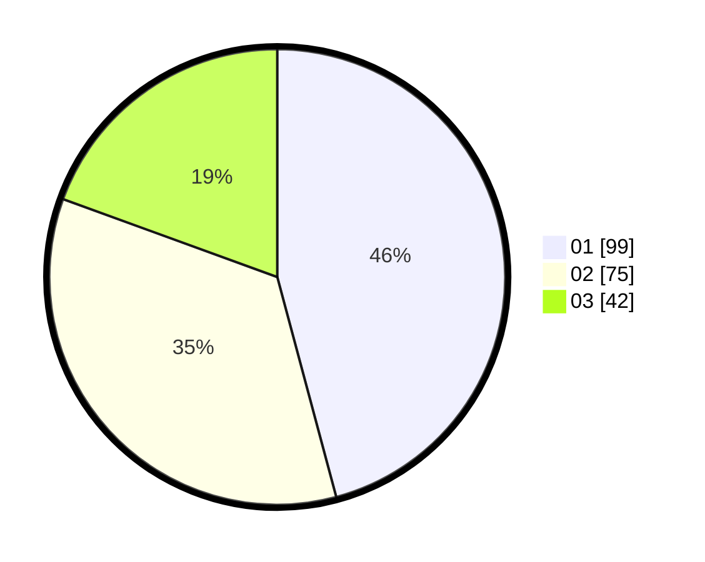

# Hasil

Hasil perolehan suara paslon dapat dilihat pada file paslon-01.txt, paslon-02.txt, dan paslon-03.txt.

Jika tidak ada, artinya data tersebut belum ada pada SIREKAP.

## Perolehan Suara

 * Paslon 01: **99**.
 * Paslon 02: **75**.
 * Paslon 03: **42**.

## Foto C Plano

https://sirekap-obj-formc.kpu.go.id/41f6/pemilu/ppwp/31/71/05/10/02/3171051002014-20240214-162238--da8fa6b9-69a7-4e96-9c83-232e030bb23b.jpg

https://sirekap-obj-formc.kpu.go.id/41f6/pemilu/ppwp/31/71/05/10/02/3171051002014-20240214-224036--6941b27a-e088-4c89-bb07-518a0c7ae041.jpg

https://sirekap-obj-formc.kpu.go.id/41f6/pemilu/ppwp/31/71/05/10/02/3171051002014-20240214-224116--c5373d1c-b47d-40a1-ab5b-4be1e32167cd.jpg

## DATA PEMILIH TETAP

Jumlah pemilih dalam DPT: **282**.
 * L: **138**.
 * P: **144**.

## DATA PENGGUNA HAK PILIH

Jumlah pengguna hak pilih dalam DPT: **207**.
 * L: **97**.
 * P: **110**.

Jumlah pengguna hak pilih dalam DPTb: **9**.
 * L: **8**.
 * P: **1**.

Jumlah pengguna hak pilih dalam DPK: **3**.
 * L: **1**.
 * P: **2**.

Jumlah pengguna hak pilih: **219**.
 * L: **106**.
 * P: **113**.

## JUMLAH SUARA SAH DAN TIDAK SAH

JUMLAH SELURUH SUARA SAH: **216**.

JUMLAH SUARA TIDAK SAH: **5**.

JUMLAH SELURUH SUARA SAH DAN SUARA TIDAK SAH: **221**.
