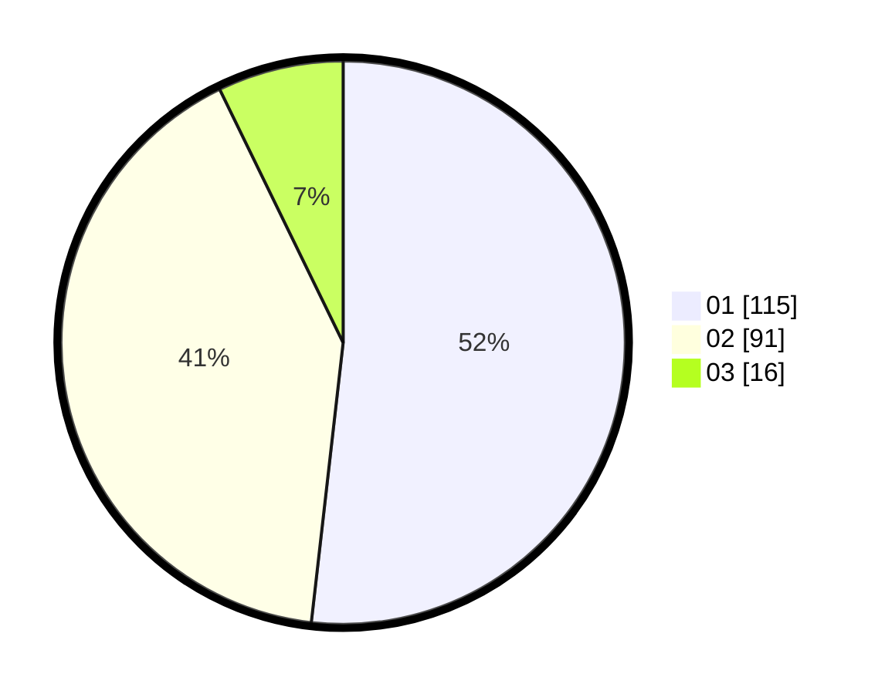

# Hasil

Hasil perolehan suara paslon dapat dilihat pada file paslon-01.txt, paslon-02.txt, dan paslon-03.txt.

Jika tidak ada, artinya data tersebut belum ada pada SIREKAP.

## Perolehan Suara

 * Paslon 01: **115**.
 * Paslon 02: **91**.
 * Paslon 03: **16**.

## Foto C Plano

https://sirekap-obj-formc.kpu.go.id/f290/pemilu/ppwp/31/71/05/10/02/3171051002018-20240214-200016--ebdea76b-5c99-41dc-9a40-7c8d0c6b039e.jpg

https://sirekap-obj-formc.kpu.go.id/f290/pemilu/ppwp/31/71/05/10/02/3171051002018-20240214-202521--9a520c7d-a168-437b-8266-5d48c2c57f21.jpg

https://sirekap-obj-formc.kpu.go.id/f290/pemilu/ppwp/31/71/05/10/02/3171051002018-20240214-202633--f3eef909-9390-4f62-8906-d9f41a8d03db.jpg

## DATA PEMILIH TETAP

Jumlah pemilih dalam DPT: **287**.
 * L: **136**.
 * P: **151**.

## DATA PENGGUNA HAK PILIH

Jumlah pengguna hak pilih dalam DPT: **226**.
 * L: **106**.
 * P: **120**.

Jumlah pengguna hak pilih dalam DPTb: **0**.
 * L: **0**.
 * P: **0**.

Jumlah pengguna hak pilih dalam DPK: **1**.
 * L: **1**.
 * P: **0**.

Jumlah pengguna hak pilih: **227**.
 * L: **107**.
 * P: **120**.

## JUMLAH SUARA SAH DAN TIDAK SAH

JUMLAH SELURUH SUARA SAH: **223**.

JUMLAH SUARA TIDAK SAH: **4**.

JUMLAH SELURUH SUARA SAH DAN SUARA TIDAK SAH: **227**.
