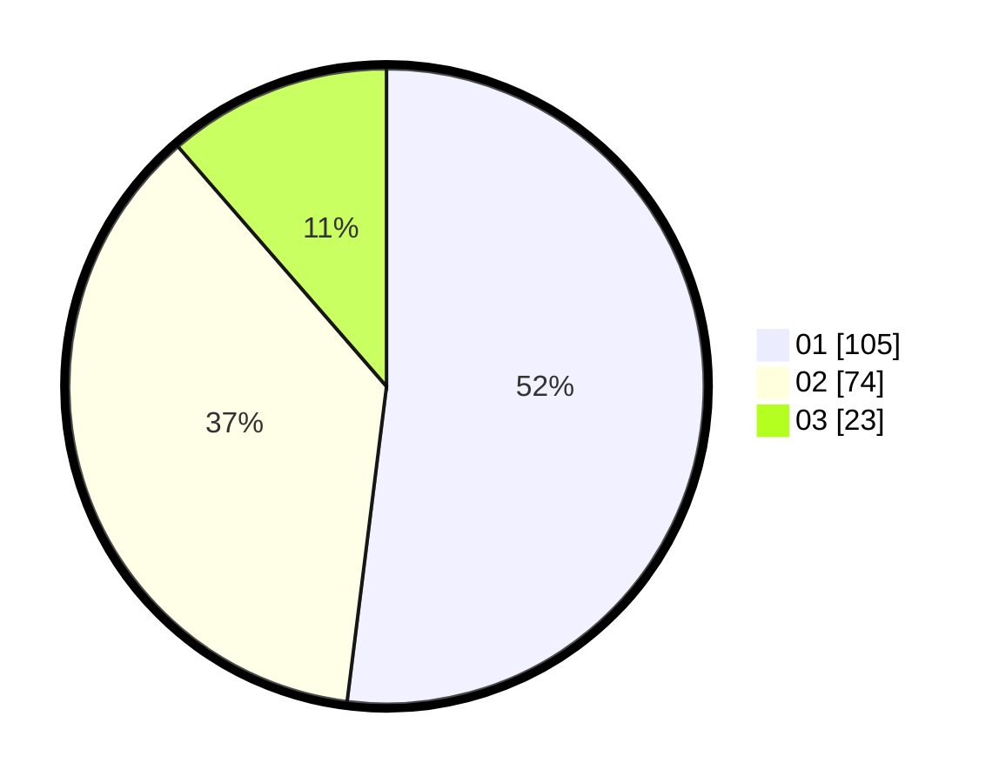

# Hasil

Hasil perolehan suara paslon dapat dilihat pada file paslon-01.txt, paslon-02.txt, dan paslon-03.txt.

Jika tidak ada, artinya data tersebut belum ada pada SIREKAP.

## Perolehan Suara

 * Paslon 01: **105**.
 * Paslon 02: **74**.
 * Paslon 03: **23**.

## Foto C Plano

https://sirekap-obj-formc.kpu.go.id/9699/pemilu/ppwp/31/71/05/10/02/3171051002019-20240214-213039--21991ca9-59bb-4f92-af42-c8c6be769afc.jpg

https://sirekap-obj-formc.kpu.go.id/9699/pemilu/ppwp/31/71/05/10/02/3171051002019-20240214-222525--be0a231d-b086-417b-89f6-54eea889514f.jpg

https://sirekap-obj-formc.kpu.go.id/9699/pemilu/ppwp/31/71/05/10/02/3171051002019-20240214-213145--103f92c3-6158-4046-9297-1c48d20257fd.jpg

## DATA PEMILIH TETAP

Jumlah pemilih dalam DPT: **287**.
 * L: **150**.
 * P: **137**.

## DATA PENGGUNA HAK PILIH

Jumlah pengguna hak pilih dalam DPT: **204**.
 * L: **100**.
 * P: **104**.

Jumlah pengguna hak pilih dalam DPTb: **0**.
 * L: **0**.
 * P: **0**.

Jumlah pengguna hak pilih dalam DPK: **2**.
 * L: **1**.
 * P: **1**.

Jumlah pengguna hak pilih: **206**.
 * L: **101**.
 * P: **105**.

## JUMLAH SUARA SAH DAN TIDAK SAH

JUMLAH SELURUH SUARA SAH: **202**.

JUMLAH SUARA TIDAK SAH: **4**.

JUMLAH SELURUH SUARA SAH DAN SUARA TIDAK SAH: **206**.
