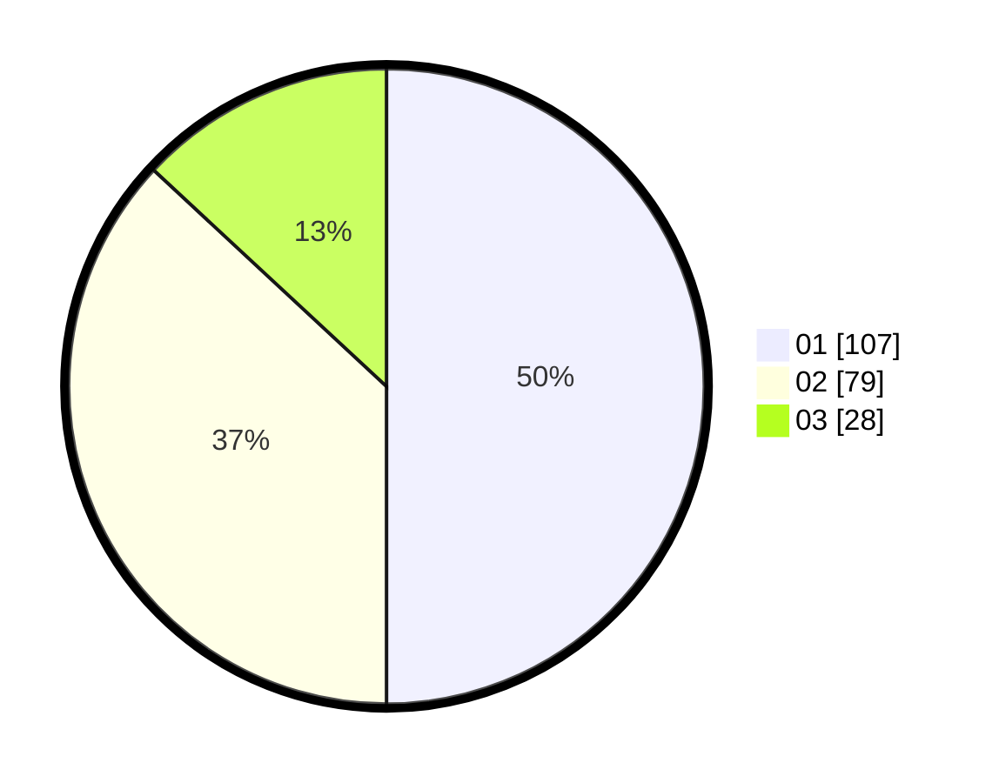

# Hasil

Hasil perolehan suara paslon dapat dilihat pada file paslon-01.txt, paslon-02.txt, dan paslon-03.txt.

Jika tidak ada, artinya data tersebut belum ada pada SIREKAP.

## Perolehan Suara

 * Paslon 01: **107**.
 * Paslon 02: **79**.
 * Paslon 03: **28**.

## Foto C Plano

https://sirekap-obj-formc.kpu.go.id/8629/pemilu/ppwp/31/71/05/10/02/3171051002020-20240216-155652--9169182a-e141-48ad-a673-c8d0fd3de650.jpg

https://sirekap-obj-formc.kpu.go.id/8629/pemilu/ppwp/31/71/05/10/02/3171051002020-20240214-155328--808134b6-90a4-4af1-8be1-ed82b57d3ec0.jpg

https://sirekap-obj-formc.kpu.go.id/8629/pemilu/ppwp/31/71/05/10/02/3171051002020-20240214-155426--daa32e05-7c95-4e34-9624-387853025078.jpg

## DATA PEMILIH TETAP

Jumlah pemilih dalam DPT: **285**.
 * L: **141**.
 * P: **144**.

## DATA PENGGUNA HAK PILIH

Jumlah pengguna hak pilih dalam DPT: **215**.
 * L: **99**.
 * P: **116**.

Jumlah pengguna hak pilih dalam DPTb: **0**.
 * L: **0**.
 * P: **0**.

Jumlah pengguna hak pilih dalam DPK: **0**.
 * L: **0**.
 * P: **0**.

Jumlah pengguna hak pilih: **215**.
 * L: **99**.
 * P: **116**.

## JUMLAH SUARA SAH DAN TIDAK SAH

JUMLAH SELURUH SUARA SAH: **214**.

JUMLAH SUARA TIDAK SAH: **1**.

JUMLAH SELURUH SUARA SAH DAN SUARA TIDAK SAH: **215**.
