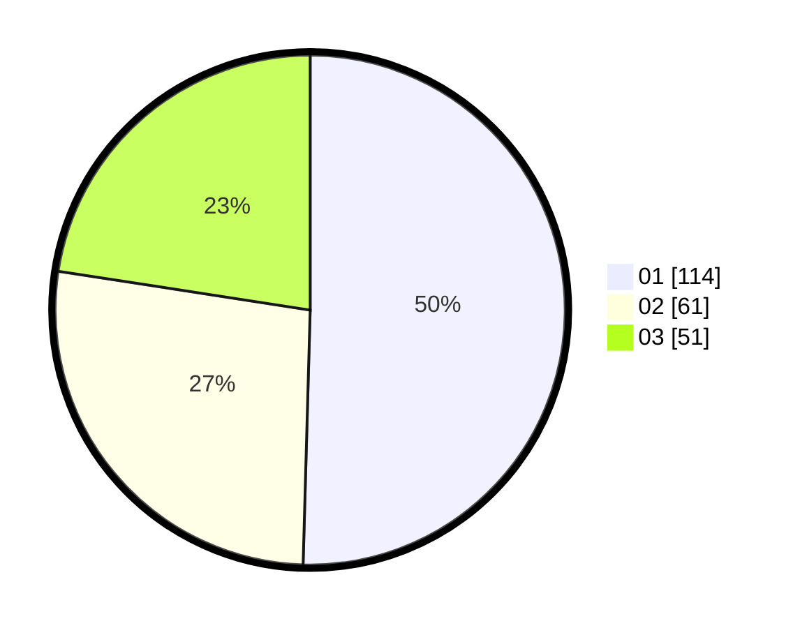

# Hasil

Hasil perolehan suara paslon dapat dilihat pada file paslon-01.txt, paslon-02.txt, dan paslon-03.txt.

Jika tidak ada, artinya data tersebut belum ada pada SIREKAP.

## Perolehan Suara

 * Paslon 01: **114**.
 * Paslon 02: **61**.
 * Paslon 03: **51**.

## Foto C Plano

https://sirekap-obj-formc.kpu.go.id/f422/pemilu/ppwp/31/71/05/10/02/3171051002024-20240214-185717--5103e574-316d-485a-bccd-eb9a801bcd95.jpg

https://sirekap-obj-formc.kpu.go.id/f422/pemilu/ppwp/31/71/05/10/02/3171051002024-20240214-185221--89cc63ec-7b96-4672-91aa-e0cff01819ec.jpg

https://sirekap-obj-formc.kpu.go.id/f422/pemilu/ppwp/31/71/05/10/02/3171051002024-20240214-185553--50618db6-1271-4a84-9ee8-aed08c4366ea.jpg

## DATA PEMILIH TETAP

Jumlah pemilih dalam DPT: **279**.
 * L: **126**.
 * P: **153**.

## DATA PENGGUNA HAK PILIH

Jumlah pengguna hak pilih dalam DPT: **207**.
 * L: **91**.
 * P: **116**.

Jumlah pengguna hak pilih dalam DPTb: **20**.
 * L: **10**.
 * P: **10**.

Jumlah pengguna hak pilih dalam DPK: **0**.
 * L: **0**.
 * P: **0**.

Jumlah pengguna hak pilih: **227**.
 * L: **101**.
 * P: **126**.

## JUMLAH SUARA SAH DAN TIDAK SAH

JUMLAH SELURUH SUARA SAH: **226**.

JUMLAH SUARA TIDAK SAH: **1**.

JUMLAH SELURUH SUARA SAH DAN SUARA TIDAK SAH: **227**.
