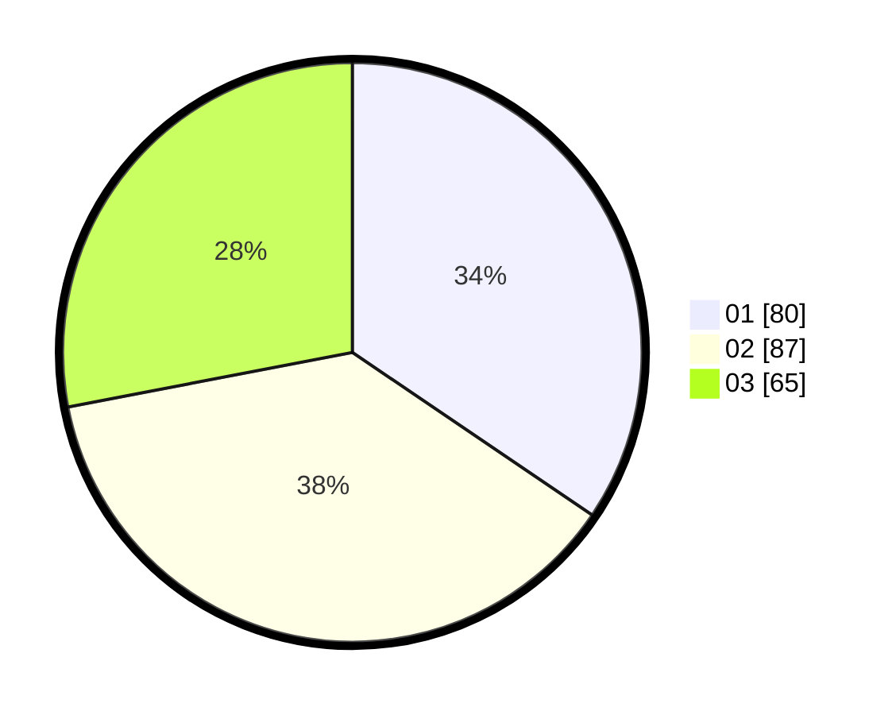

# Hasil

Hasil perolehan suara paslon dapat dilihat pada file paslon-01.txt, paslon-02.txt, dan paslon-03.txt.

Jika tidak ada, artinya data tersebut belum ada pada SIREKAP.

## Perolehan Suara

 * Paslon 01: **80**.
 * Paslon 02: **87**.
 * Paslon 03: **65**.

## Foto C Plano

https://sirekap-obj-formc.kpu.go.id/cb37/pemilu/ppwp/31/71/05/10/02/3171051002025-20240214-232423--81e3cd98-97f7-4a48-b993-c8b4d6826261.jpg

https://sirekap-obj-formc.kpu.go.id/cb37/pemilu/ppwp/31/71/05/10/02/3171051002025-20240214-232435--4c9c10f3-3d9a-4608-bba0-8aac2e6b8aad.jpg
