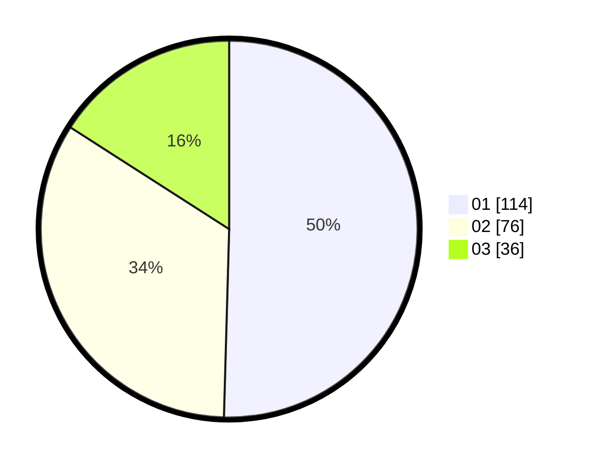

# Hasil

Hasil perolehan suara paslon dapat dilihat pada file paslon-01.txt, paslon-02.txt, dan paslon-03.txt.

Jika tidak ada, artinya data tersebut belum ada pada SIREKAP.

## Perolehan Suara

 * Paslon 01: **114**.
 * Paslon 02: **76**.
 * Paslon 03: **36**.

## Foto C Plano

https://sirekap-obj-formc.kpu.go.id/6ad3/pemilu/ppwp/31/71/05/10/02/3171051002031-20240216-005328--debb0886-1860-4228-ae59-2005dbf81ecb.jpg

https://sirekap-obj-formc.kpu.go.id/6ad3/pemilu/ppwp/31/71/05/10/02/3171051002031-20240216-005331--ae2441ee-3dc6-4d44-bb23-02a99c9230d2.jpg

https://sirekap-obj-formc.kpu.go.id/6ad3/pemilu/ppwp/31/71/05/10/02/3171051002031-20240216-005329--b30f7895-31dc-4da8-b5f8-1212c937b893.jpg

## DATA PEMILIH TETAP

Jumlah pemilih dalam DPT: **294**.
 * L: **147**.
 * P: **147**.

## DATA PENGGUNA HAK PILIH

Jumlah pengguna hak pilih dalam DPT: **225**.
 * L: **110**.
 * P: **115**.

Jumlah pengguna hak pilih dalam DPTb: **5**.
 * L: **3**.
 * P: **2**.

Jumlah pengguna hak pilih dalam DPK: **0**.
 * L: **0**.
 * P: **0**.

Jumlah pengguna hak pilih: **230**.
 * L: **113**.
 * P: **117**.

## JUMLAH SUARA SAH DAN TIDAK SAH

JUMLAH SELURUH SUARA SAH: **226**.

JUMLAH SUARA TIDAK SAH: **4**.

JUMLAH SELURUH SUARA SAH DAN SUARA TIDAK SAH: **230**.
