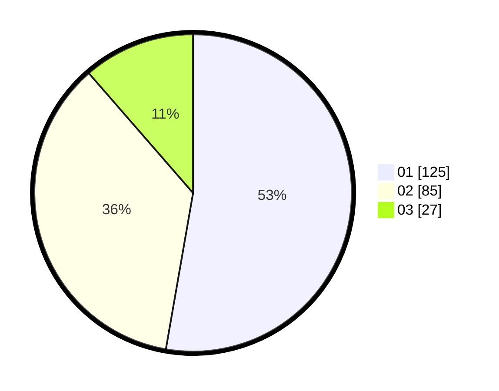

# Hasil

Hasil perolehan suara paslon dapat dilihat pada file paslon-01.txt, paslon-02.txt, dan paslon-03.txt.

Jika tidak ada, artinya data tersebut belum ada pada SIREKAP.

## Perolehan Suara

 * Paslon 01: **125**.
 * Paslon 02: **85**.
 * Paslon 03: **27**.

## Foto C Plano

https://sirekap-obj-formc.kpu.go.id/6c22/pemilu/ppwp/31/71/05/10/02/3171051002032-20240216-215211--b486227d-c96f-4a60-9636-e1a952a5e4eb.jpg

https://sirekap-obj-formc.kpu.go.id/6c22/pemilu/ppwp/31/71/05/10/02/3171051002032-20240215-054352--bdfafbda-83ca-466d-8a71-ce6cadc840e3.jpg

https://sirekap-obj-formc.kpu.go.id/6c22/pemilu/ppwp/31/71/05/10/02/3171051002032-20240217-061156--85b305a8-4183-40c3-a9c8-b78f26db7757.jpg

## DATA PEMILIH TETAP

Jumlah pemilih dalam DPT: **295**.
 * L: **139**.
 * P: **156**.

## DATA PENGGUNA HAK PILIH

Jumlah pengguna hak pilih dalam DPT: **237**.
 * L: **106**.
 * P: **131**.

Jumlah pengguna hak pilih dalam DPTb: **1**.
 * L: **0**.
 * P: **1**.

Jumlah pengguna hak pilih dalam DPK: **3**.
 * L: **2**.
 * P: **1**.

Jumlah pengguna hak pilih: **241**.
 * L: **108**.
 * P: **133**.

## JUMLAH SUARA SAH DAN TIDAK SAH

JUMLAH SELURUH SUARA SAH: **237**.

JUMLAH SUARA TIDAK SAH: **4**.

JUMLAH SELURUH SUARA SAH DAN SUARA TIDAK SAH: **241**.
