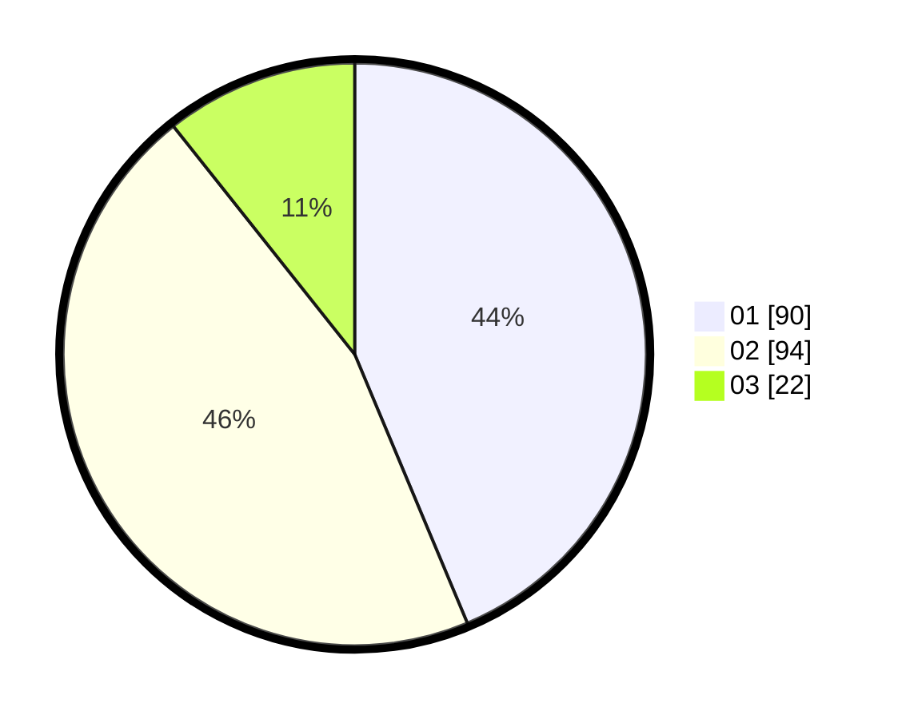

# Hasil

Hasil perolehan suara paslon dapat dilihat pada file paslon-01.txt, paslon-02.txt, dan paslon-03.txt.

Jika tidak ada, artinya data tersebut belum ada pada SIREKAP.

## Perolehan Suara

 * Paslon 01: **90**.
 * Paslon 02: **94**.
 * Paslon 03: **22**.

## Foto C Plano

https://sirekap-obj-formc.kpu.go.id/8812/pemilu/ppwp/31/71/05/10/02/3171051002037-20240214-190942--4ab7e7d7-bd70-4498-aad5-883a31d92c1f.jpg

https://sirekap-obj-formc.kpu.go.id/8812/pemilu/ppwp/31/71/05/10/02/3171051002037-20240214-190945--7147ac70-e65f-48f1-872b-c37503a7d291.jpg

https://sirekap-obj-formc.kpu.go.id/8812/pemilu/ppwp/31/71/05/10/02/3171051002037-20240214-191005--751cef15-9f17-45b3-8819-c364a00253a7.jpg

## DATA PEMILIH TETAP

Jumlah pemilih dalam DPT: **268**.
 * L: **135**.
 * P: **133**.

## DATA PENGGUNA HAK PILIH

Jumlah pengguna hak pilih dalam DPT: **210**.
 * L: **102**.
 * P: **108**.

Jumlah pengguna hak pilih dalam DPTb: **2**.
 * L: **0**.
 * P: **2**.

Jumlah pengguna hak pilih dalam DPK: **0**.
 * L: **0**.
 * P: **0**.

Jumlah pengguna hak pilih: **212**.
 * L: **102**.
 * P: **110**.

## JUMLAH SUARA SAH DAN TIDAK SAH

JUMLAH SELURUH SUARA SAH: **207**.

JUMLAH SUARA TIDAK SAH: **5**.

JUMLAH SELURUH SUARA SAH DAN SUARA TIDAK SAH: **212**.
