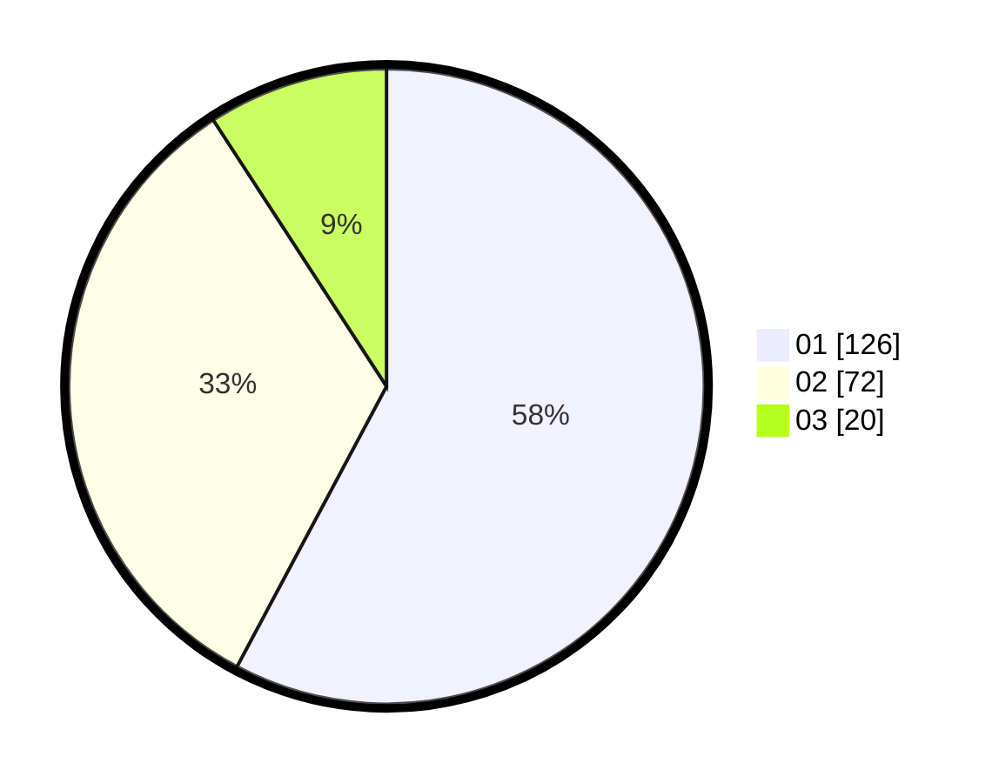

# Hasil

Hasil perolehan suara paslon dapat dilihat pada file paslon-01.txt, paslon-02.txt, dan paslon-03.txt.

Jika tidak ada, artinya data tersebut belum ada pada SIREKAP.

## Perolehan Suara

 * Paslon 01: **126**.
 * Paslon 02: **72**.
 * Paslon 03: **20**.

## Foto C Plano

https://sirekap-obj-formc.kpu.go.id/d7c0/pemilu/ppwp/31/71/05/10/02/3171051002042-20240215-221022--c288b909-b016-481f-8d18-3fdc3cae22a6.jpg

https://sirekap-obj-formc.kpu.go.id/d7c0/pemilu/ppwp/31/71/05/10/02/3171051002042-20240215-221023--4cdbf598-087e-485e-ae50-ab073cb8ffc0.jpg

https://sirekap-obj-formc.kpu.go.id/d7c0/pemilu/ppwp/31/71/05/10/02/3171051002042-20240215-221022--2dada7b7-cf7b-49a3-a3f8-806b3225f987.jpg

## DATA PEMILIH TETAP

Jumlah pemilih dalam DPT: **277**.
 * L: **136**.
 * P: **141**.

## DATA PENGGUNA HAK PILIH

Jumlah pengguna hak pilih dalam DPT: **216**.
 * L: **104**.
 * P: **112**.

Jumlah pengguna hak pilih dalam DPTb: **0**.
 * L: **0**.
 * P: **0**.

Jumlah pengguna hak pilih dalam DPK: **2**.
 * L: **0**.
 * P: **2**.

Jumlah pengguna hak pilih: **218**.
 * L: **104**.
 * P: **114**.

## JUMLAH SUARA SAH DAN TIDAK SAH

JUMLAH SELURUH SUARA SAH: **218**.

JUMLAH SUARA TIDAK SAH: **0**.

JUMLAH SELURUH SUARA SAH DAN SUARA TIDAK SAH: **218**.
