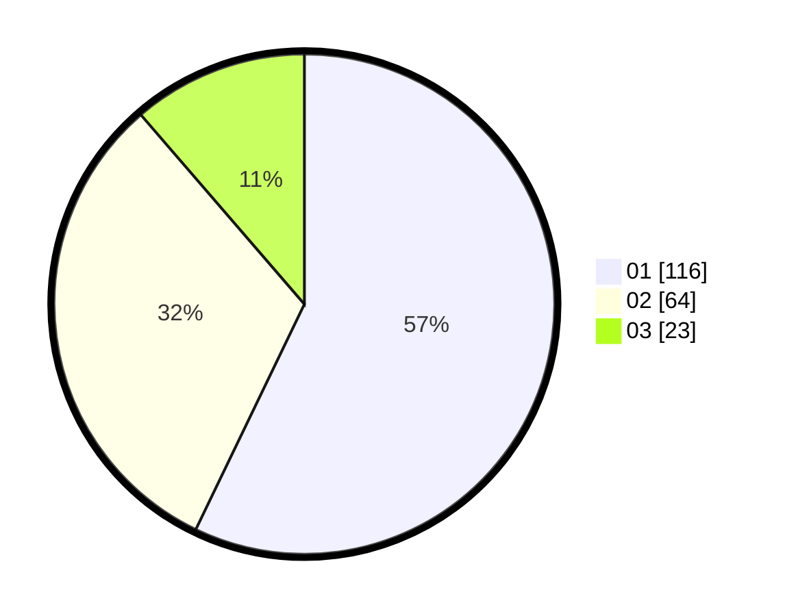

# Hasil

Hasil perolehan suara paslon dapat dilihat pada file paslon-01.txt, paslon-02.txt, dan paslon-03.txt.

Jika tidak ada, artinya data tersebut belum ada pada SIREKAP.

## Perolehan Suara

 * Paslon 01: **116**.
 * Paslon 02: **64**.
 * Paslon 03: **23**.

## Foto C Plano

https://sirekap-obj-formc.kpu.go.id/5103/pemilu/ppwp/31/71/05/10/02/3171051002043-20240214-191917--cca0d490-a409-4245-8984-969ce6a319cf.jpg

https://sirekap-obj-formc.kpu.go.id/5103/pemilu/ppwp/31/71/05/10/02/3171051002043-20240214-192023--aefbcd50-4b25-4b48-8500-110306b9a909.jpg

https://sirekap-obj-formc.kpu.go.id/5103/pemilu/ppwp/31/71/05/10/02/3171051002043-20240214-192106--ede8847c-72f0-4278-9910-be9f0ecb7619.jpg

## DATA PEMILIH TETAP

Jumlah pemilih dalam DPT: **277**.
 * L: **134**.
 * P: **143**.

## DATA PENGGUNA HAK PILIH

Jumlah pengguna hak pilih dalam DPT: **206**.
 * L: **96**.
 * P: **110**.

Jumlah pengguna hak pilih dalam DPTb: **0**.
 * L: **0**.
 * P: **0**.

Jumlah pengguna hak pilih dalam DPK: **0**.
 * L: **0**.
 * P: **0**.

Jumlah pengguna hak pilih: **206**.
 * L: **96**.
 * P: **110**.

## JUMLAH SUARA SAH DAN TIDAK SAH

JUMLAH SELURUH SUARA SAH: **203**.

JUMLAH SUARA TIDAK SAH: **3**.

JUMLAH SELURUH SUARA SAH DAN SUARA TIDAK SAH: **206**.
