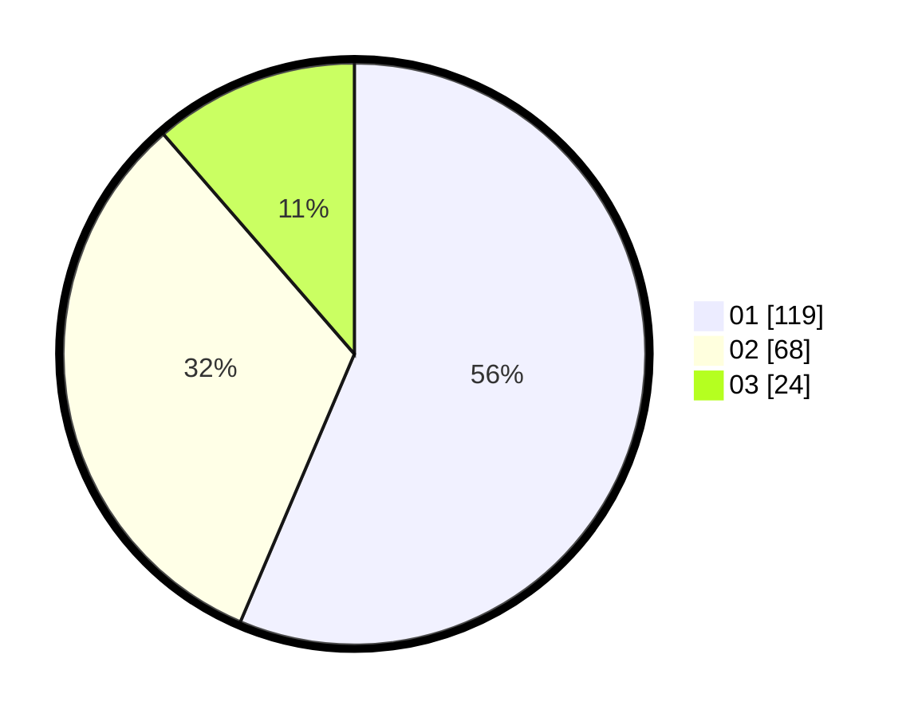

# Hasil

Hasil perolehan suara paslon dapat dilihat pada file paslon-01.txt, paslon-02.txt, dan paslon-03.txt.

Jika tidak ada, artinya data tersebut belum ada pada SIREKAP.

## Perolehan Suara

 * Paslon 01: **119**.
 * Paslon 02: **68**.
 * Paslon 03: **24**.

## Foto C Plano

https://sirekap-obj-formc.kpu.go.id/9966/pemilu/ppwp/31/71/05/10/02/3171051002044-20240216-210411--afc9d8be-5919-4b37-8ecf-c2294ba29f22.jpg

https://sirekap-obj-formc.kpu.go.id/9966/pemilu/ppwp/31/71/05/10/02/3171051002044-20240216-210413--fb0c15bd-f6bd-4eb4-9a90-9d24d26ae4cb.jpg

https://sirekap-obj-formc.kpu.go.id/9966/pemilu/ppwp/31/71/05/10/02/3171051002044-20240216-210412--5de3e6b9-e568-48bf-897e-2676abdde83f.jpg

## DATA PEMILIH TETAP

Jumlah pemilih dalam DPT: **260**.
 * L: **120**.
 * P: **140**.

## DATA PENGGUNA HAK PILIH

Jumlah pengguna hak pilih dalam DPT: **213**.
 * L: **100**.
 * P: **113**.

Jumlah pengguna hak pilih dalam DPTb: **1**.
 * L: **1**.
 * P: **0**.

Jumlah pengguna hak pilih dalam DPK: **1**.
 * L: **1**.
 * P: **0**.

Jumlah pengguna hak pilih: **215**.
 * L: **102**.
 * P: **113**.

## JUMLAH SUARA SAH DAN TIDAK SAH

JUMLAH SELURUH SUARA SAH: **211**.

JUMLAH SUARA TIDAK SAH: **4**.

JUMLAH SELURUH SUARA SAH DAN SUARA TIDAK SAH: **215**.
