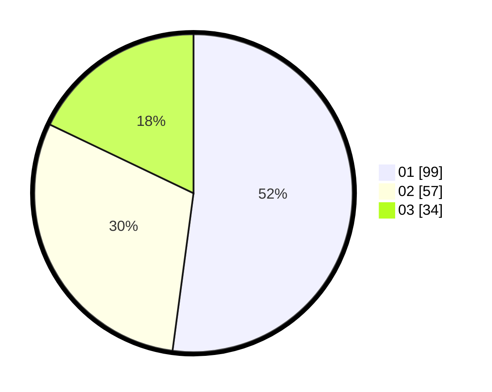

# Hasil

Hasil perolehan suara paslon dapat dilihat pada file paslon-01.txt, paslon-02.txt, dan paslon-03.txt.

Jika tidak ada, artinya data tersebut belum ada pada SIREKAP.

## Perolehan Suara

 * Paslon 01: **99**.
 * Paslon 02: **57**.
 * Paslon 03: **34**.

## Foto C Plano

https://sirekap-obj-formc.kpu.go.id/673a/pemilu/ppwp/31/71/05/10/02/3171051002047-20240216-021341--539ab3b8-29e4-4770-8d69-f9225c742382.jpg

https://sirekap-obj-formc.kpu.go.id/673a/pemilu/ppwp/31/71/05/10/02/3171051002047-20240216-021342--6d30da87-64a1-44db-a675-8e7ef1ae1df4.jpg

https://sirekap-obj-formc.kpu.go.id/673a/pemilu/ppwp/31/71/05/10/02/3171051002047-20240216-021342--f2158f6b-359b-4be7-b9a3-6d796551637d.jpg

## DATA PEMILIH TETAP

Jumlah pemilih dalam DPT: **239**.
 * L: **120**.
 * P: **119**.

## DATA PENGGUNA HAK PILIH

Jumlah pengguna hak pilih dalam DPT: **189**.
 * L: **92**.
 * P: **97**.

Jumlah pengguna hak pilih dalam DPTb: **0**.
 * L: **0**.
 * P: **0**.

Jumlah pengguna hak pilih dalam DPK: **2**.
 * L: **1**.
 * P: **1**.

Jumlah pengguna hak pilih: **191**.
 * L: **93**.
 * P: **98**.

## JUMLAH SUARA SAH DAN TIDAK SAH

JUMLAH SELURUH SUARA SAH: **190**.

JUMLAH SUARA TIDAK SAH: **1**.

JUMLAH SELURUH SUARA SAH DAN SUARA TIDAK SAH: **191**.
