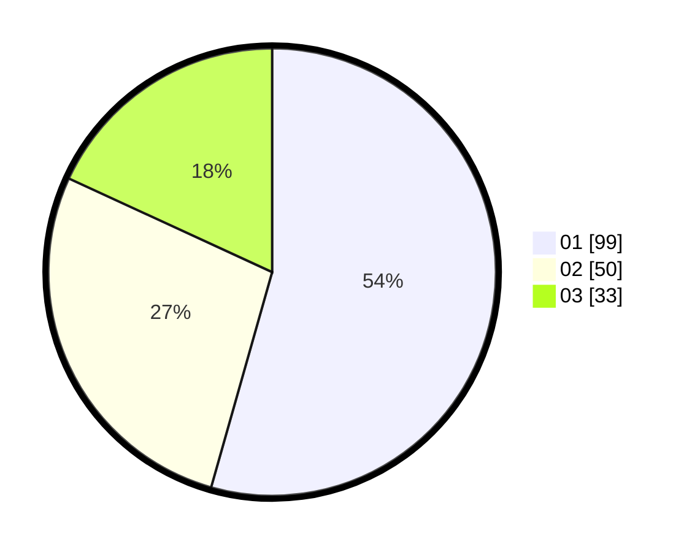

# Hasil

Hasil perolehan suara paslon dapat dilihat pada file paslon-01.txt, paslon-02.txt, dan paslon-03.txt.

Jika tidak ada, artinya data tersebut belum ada pada SIREKAP.

## Perolehan Suara

 * Paslon 01: **99**.
 * Paslon 02: **50**.
 * Paslon 03: **33**.

## Foto C Plano

https://sirekap-obj-formc.kpu.go.id/0aa1/pemilu/ppwp/31/71/05/10/02/3171051002048-20240216-082608--fb3ed0fa-ed0f-457b-a7c2-1cc2ab89a1cc.jpg

https://sirekap-obj-formc.kpu.go.id/0aa1/pemilu/ppwp/31/71/05/10/02/3171051002048-20240216-082614--c25c13b1-0d73-483c-98b3-2cbdc4b8e5ea.jpg

https://sirekap-obj-formc.kpu.go.id/0aa1/pemilu/ppwp/31/71/05/10/02/3171051002048-20240216-082612--9691b84a-5538-4732-8ca2-31e57d994cbf.jpg

## DATA PEMILIH TETAP

Jumlah pemilih dalam DPT: **242**.
 * L: **115**.
 * P: **147**.

## DATA PENGGUNA HAK PILIH

Jumlah pengguna hak pilih dalam DPT: **182**.
 * L: **80**.
 * P: **100**.

Jumlah pengguna hak pilih dalam DPTb: **0**.
 * L: **0**.
 * P: **0**.

Jumlah pengguna hak pilih dalam DPK: **2**.
 * L: **1**.
 * P: **1**.

Jumlah pengguna hak pilih: **182**.
 * L: **81**.
 * P: **101**.

## JUMLAH SUARA SAH DAN TIDAK SAH

JUMLAH SELURUH SUARA SAH: **182**.

JUMLAH SUARA TIDAK SAH: **0**.

JUMLAH SELURUH SUARA SAH DAN SUARA TIDAK SAH: **182**.
