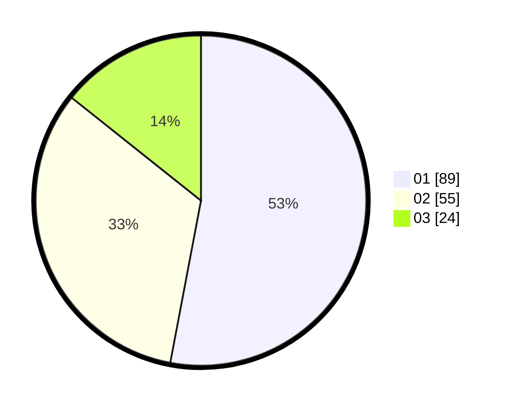

# Hasil

Hasil perolehan suara paslon dapat dilihat pada file paslon-01.txt, paslon-02.txt, dan paslon-03.txt.

Jika tidak ada, artinya data tersebut belum ada pada SIREKAP.

## Perolehan Suara

 * Paslon 01: **89**.
 * Paslon 02: **55**.
 * Paslon 03: **24**.

## Foto C Plano

https://sirekap-obj-formc.kpu.go.id/5161/pemilu/ppwp/31/71/05/10/02/3171051002049-20240216-130555--cfb1641e-3cb8-4799-80dc-df768e33d4ff.jpg

https://sirekap-obj-formc.kpu.go.id/5161/pemilu/ppwp/31/71/05/10/02/3171051002049-20240216-130557--0337bb36-0985-4eeb-aa67-9f8c825d14fe.jpg

https://sirekap-obj-formc.kpu.go.id/5161/pemilu/ppwp/31/71/05/10/02/3171051002049-20240216-130556--8d357821-32f4-4b15-8ced-4431ab9691ef.jpg

## DATA PEMILIH TETAP

Jumlah pemilih dalam DPT: **236**.
 * L: **126**.
 * P: **110**.

## DATA PENGGUNA HAK PILIH

Jumlah pengguna hak pilih dalam DPT: **169**.
 * L: **84**.
 * P: **85**.

Jumlah pengguna hak pilih dalam DPTb: **0**.
 * L: **0**.
 * P: **0**.

Jumlah pengguna hak pilih dalam DPK: **1**.
 * L: **1**.
 * P: **0**.

Jumlah pengguna hak pilih: **170**.
 * L: **85**.
 * P: **85**.

## JUMLAH SUARA SAH DAN TIDAK SAH

JUMLAH SELURUH SUARA SAH: **168**.

JUMLAH SUARA TIDAK SAH: **2**.

JUMLAH SELURUH SUARA SAH DAN SUARA TIDAK SAH: **170**.
