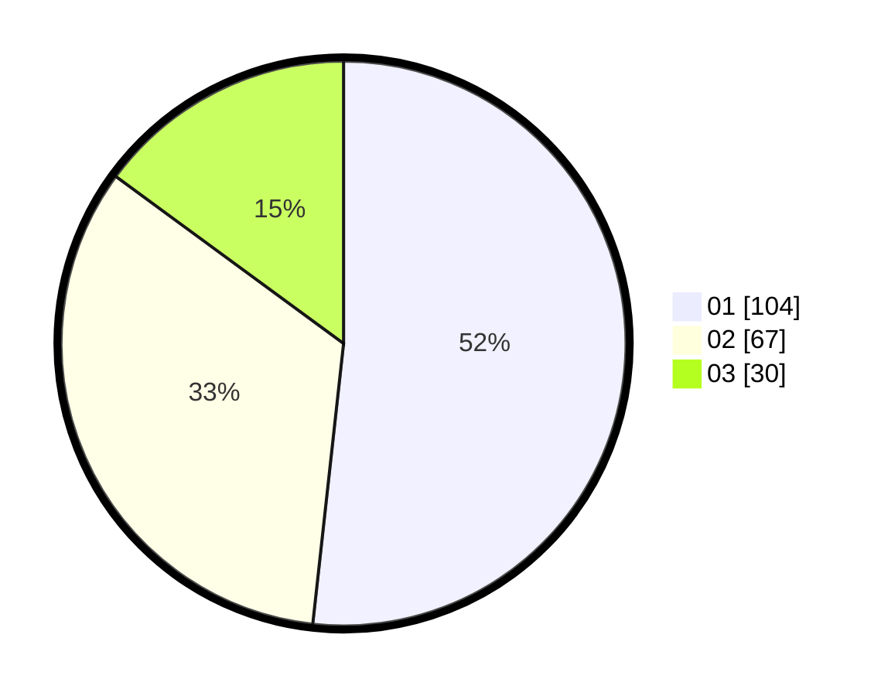

# Hasil

Hasil perolehan suara paslon dapat dilihat pada file paslon-01.txt, paslon-02.txt, dan paslon-03.txt.

Jika tidak ada, artinya data tersebut belum ada pada SIREKAP.

## Perolehan Suara

 * Paslon 01: **104**.
 * Paslon 02: **67**.
 * Paslon 03: **30**.

## Foto C Plano

https://sirekap-obj-formc.kpu.go.id/5832/pemilu/ppwp/31/71/05/10/02/3171051002050-20240216-131506--bc174907-2fc2-4103-a067-f62be2cb6333.jpg

https://sirekap-obj-formc.kpu.go.id/5832/pemilu/ppwp/31/71/05/10/02/3171051002050-20240216-131507--43f0c1b9-1e46-4a76-854c-9208d5bc2d99.jpg

https://sirekap-obj-formc.kpu.go.id/5832/pemilu/ppwp/31/71/05/10/02/3171051002050-20240216-131507--e66fe793-2d6c-4487-81dd-b761633658ef.jpg

## DATA PEMILIH TETAP

Jumlah pemilih dalam DPT: **260**.
 * L: **124**.
 * P: **136**.

## DATA PENGGUNA HAK PILIH

Jumlah pengguna hak pilih dalam DPT: **201**.
 * L: **91**.
 * P: **110**.

Jumlah pengguna hak pilih dalam DPTb: **1**.
 * L: **0**.
 * P: **1**.

Jumlah pengguna hak pilih dalam DPK: **3**.
 * L: **2**.
 * P: **1**.

Jumlah pengguna hak pilih: **205**.
 * L: **93**.
 * P: **112**.

## JUMLAH SUARA SAH DAN TIDAK SAH

JUMLAH SELURUH SUARA SAH: **201**.

JUMLAH SUARA TIDAK SAH: **4**.

JUMLAH SELURUH SUARA SAH DAN SUARA TIDAK SAH: **205**.
