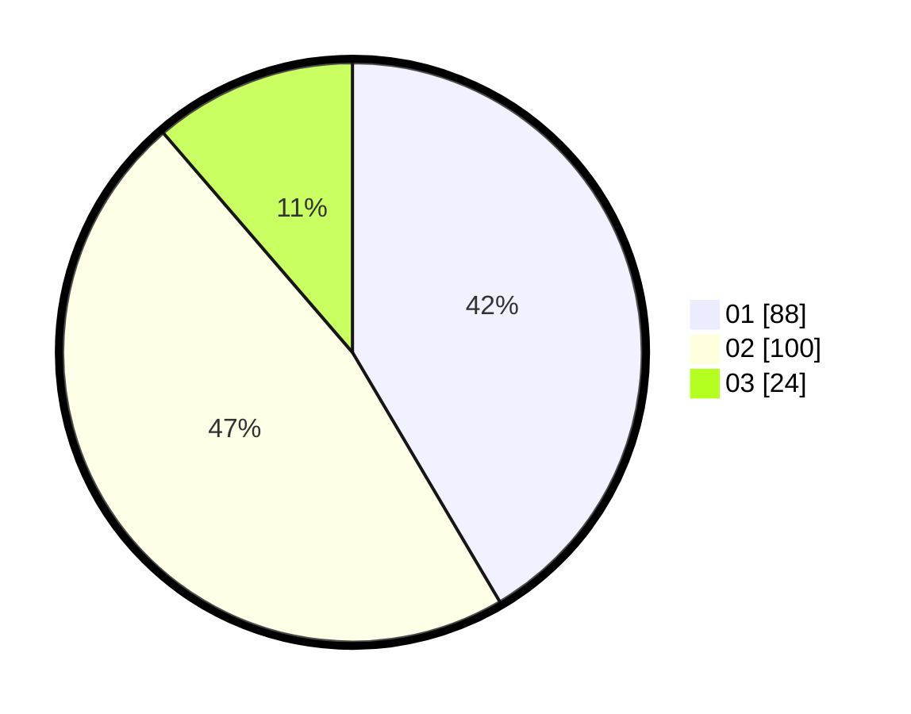

# Hasil

Hasil perolehan suara paslon dapat dilihat pada file paslon-01.txt, paslon-02.txt, dan paslon-03.txt.

Jika tidak ada, artinya data tersebut belum ada pada SIREKAP.

## Perolehan Suara

 * Paslon 01: **88**.
 * Paslon 02: **100**.
 * Paslon 03: **24**.

## Foto C Plano

https://sirekap-obj-formc.kpu.go.id/c5b2/pemilu/ppwp/31/71/05/10/02/3171051002053-20240216-010128--b73eddd1-4a1a-4fe4-ab66-b30223b953c3.jpg

https://sirekap-obj-formc.kpu.go.id/c5b2/pemilu/ppwp/31/71/05/10/02/3171051002053-20240216-010135--24ec2fc9-3fa2-487a-a686-984e00107b52.jpg

https://sirekap-obj-formc.kpu.go.id/c5b2/pemilu/ppwp/31/71/05/10/02/3171051002053-20240216-010132--47c2451c-3573-4e59-a302-732c6d9dfd37.jpg

## DATA PEMILIH TETAP

Jumlah pemilih dalam DPT: **275**.
 * L: **134**.
 * P: **141**.

## DATA PENGGUNA HAK PILIH

Jumlah pengguna hak pilih dalam DPT: **210**.
 * L: **105**.
 * P: **105**.

Jumlah pengguna hak pilih dalam DPTb: **0**.
 * L: **0**.
 * P: **0**.

Jumlah pengguna hak pilih dalam DPK: **4**.
 * L: **2**.
 * P: **2**.

Jumlah pengguna hak pilih: **214**.
 * L: **107**.
 * P: **107**.

## JUMLAH SUARA SAH DAN TIDAK SAH

JUMLAH SELURUH SUARA SAH: **212**.

JUMLAH SUARA TIDAK SAH: **2**.

JUMLAH SELURUH SUARA SAH DAN SUARA TIDAK SAH: **214**.
