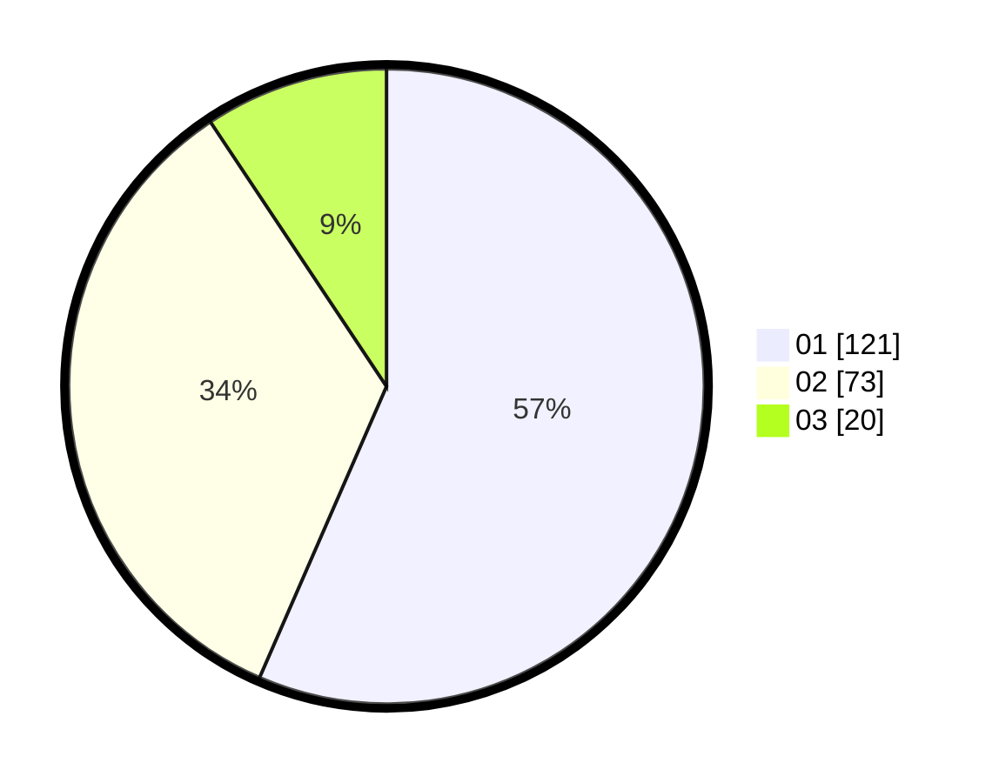

# Hasil

Hasil perolehan suara paslon dapat dilihat pada file paslon-01.txt, paslon-02.txt, dan paslon-03.txt.

Jika tidak ada, artinya data tersebut belum ada pada SIREKAP.

## Perolehan Suara

 * Paslon 01: **121**.
 * Paslon 02: **73**.
 * Paslon 03: **20**.

## Foto C Plano

https://sirekap-obj-formc.kpu.go.id/6752/pemilu/ppwp/31/71/05/10/02/3171051002056-20240215-000435--71562c7d-8254-49f8-a4c6-873372dc8504.jpg

https://sirekap-obj-formc.kpu.go.id/6752/pemilu/ppwp/31/71/05/10/02/3171051002056-20240215-000523--bb23ace0-1d7a-4db6-81a7-530c4ebb9444.jpg

https://sirekap-obj-formc.kpu.go.id/6752/pemilu/ppwp/31/71/05/10/02/3171051002056-20240215-000619--e250f290-b02a-4984-8d9b-3c3eb44abacf.jpg

## DATA PEMILIH TETAP

Jumlah pemilih dalam DPT: **248**.
 * L: **126**.
 * P: **122**.

## DATA PENGGUNA HAK PILIH

Jumlah pengguna hak pilih dalam DPT: **210**.
 * L: **104**.
 * P: **106**.

Jumlah pengguna hak pilih dalam DPTb: **0**.
 * L: **0**.
 * P: **0**.

Jumlah pengguna hak pilih dalam DPK: **4**.
 * L: **3**.
 * P: **1**.

Jumlah pengguna hak pilih: **214**.
 * L: **107**.
 * P: **107**.

## JUMLAH SUARA SAH DAN TIDAK SAH

JUMLAH SELURUH SUARA SAH: **214**.

JUMLAH SUARA TIDAK SAH: **0**.

JUMLAH SELURUH SUARA SAH DAN SUARA TIDAK SAH: **214**.
