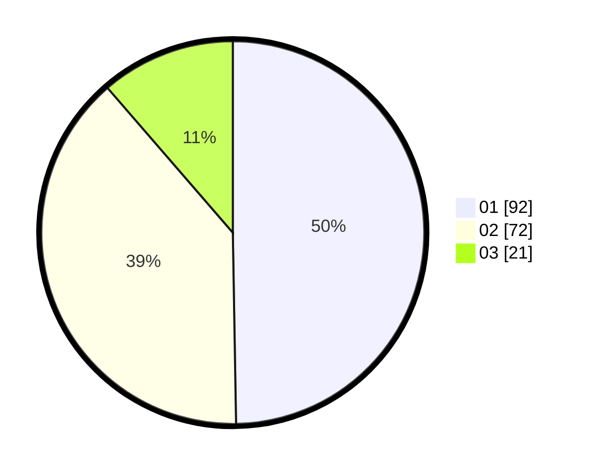

# Hasil

Hasil perolehan suara paslon dapat dilihat pada file paslon-01.txt, paslon-02.txt, dan paslon-03.txt.

Jika tidak ada, artinya data tersebut belum ada pada SIREKAP.

## Perolehan Suara

 * Paslon 01: **92**.
 * Paslon 02: **72**.
 * Paslon 03: **21**.

## Foto C Plano

https://sirekap-obj-formc.kpu.go.id/cc35/pemilu/ppwp/31/71/05/10/02/3171051002057-20240216-014147--09adfe51-079a-4951-a8e2-6fbd3eff215f.jpg

https://sirekap-obj-formc.kpu.go.id/cc35/pemilu/ppwp/31/71/05/10/02/3171051002057-20240216-014159--0b9fa3f6-d3ae-44f9-9b1a-a5c95af3b548.jpg

https://sirekap-obj-formc.kpu.go.id/cc35/pemilu/ppwp/31/71/05/10/02/3171051002057-20240216-014151--bbdb38ca-2673-4481-8cec-fa689803f6ca.jpg

## DATA PEMILIH TETAP

Jumlah pemilih dalam DPT: **244**.
 * L: **120**.
 * P: **124**.

## DATA PENGGUNA HAK PILIH

Jumlah pengguna hak pilih dalam DPT: **182**.
 * L: **98**.
 * P: **94**.

Jumlah pengguna hak pilih dalam DPTb: **1**.
 * L: **1**.
 * P: **0**.

Jumlah pengguna hak pilih dalam DPK: **5**.
 * L: **2**.
 * P: **3**.

Jumlah pengguna hak pilih: **188**.
 * L: **91**.
 * P: **97**.

## JUMLAH SUARA SAH DAN TIDAK SAH

JUMLAH SELURUH SUARA SAH: **185**.

JUMLAH SUARA TIDAK SAH: **3**.

JUMLAH SELURUH SUARA SAH DAN SUARA TIDAK SAH: **188**.
