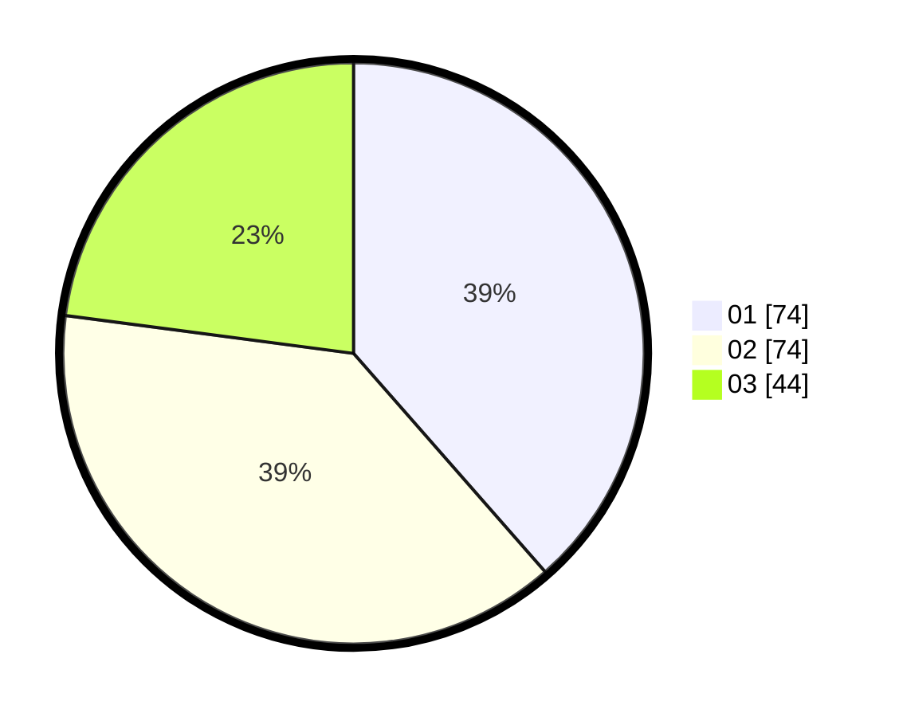

# Hasil

Hasil perolehan suara paslon dapat dilihat pada file paslon-01.txt, paslon-02.txt, dan paslon-03.txt.

Jika tidak ada, artinya data tersebut belum ada pada SIREKAP.

## Perolehan Suara

 * Paslon 01: **74**.
 * Paslon 02: **74**.
 * Paslon 03: **44**.

## Foto C Plano

https://sirekap-obj-formc.kpu.go.id/f19e/pemilu/ppwp/31/71/05/10/02/3171051002061-20240215-183625--b70c04dd-fb54-495e-a588-e5a90a2a83b2.jpg

https://sirekap-obj-formc.kpu.go.id/f19e/pemilu/ppwp/31/71/05/10/02/3171051002061-20240215-183647--32cb9a40-9037-42b5-8a20-ad3382cec4f5.jpg

https://sirekap-obj-formc.kpu.go.id/f19e/pemilu/ppwp/31/71/05/10/02/3171051002061-20240215-183636--1ff92501-37ef-44dd-9f76-439a5aa81f1f.jpg

## DATA PEMILIH TETAP

Jumlah pemilih dalam DPT: **233**.
 * L: **116**.
 * P: **117**.

## DATA PENGGUNA HAK PILIH

Jumlah pengguna hak pilih dalam DPT: **191**.
 * L: **90**.
 * P: **101**.

Jumlah pengguna hak pilih dalam DPTb: **2**.
 * L: **2**.
 * P: **0**.

Jumlah pengguna hak pilih dalam DPK: **1**.
 * L: **0**.
 * P: **1**.

Jumlah pengguna hak pilih: **194**.
 * L: **92**.
 * P: **102**.

## JUMLAH SUARA SAH DAN TIDAK SAH

JUMLAH SELURUH SUARA SAH: **192**.

JUMLAH SUARA TIDAK SAH: **2**.

JUMLAH SELURUH SUARA SAH DAN SUARA TIDAK SAH: **194**.
