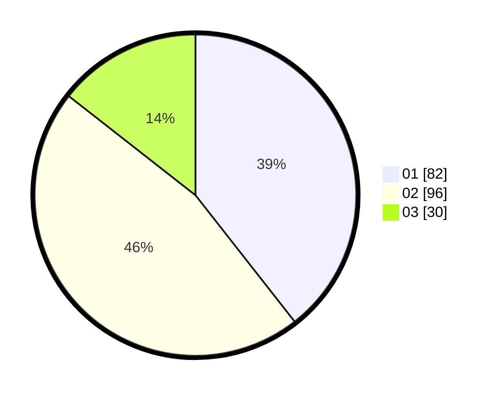

# Hasil

Hasil perolehan suara paslon dapat dilihat pada file paslon-01.txt, paslon-02.txt, dan paslon-03.txt.

Jika tidak ada, artinya data tersebut belum ada pada SIREKAP.

## Perolehan Suara

 * Paslon 01: **82**.
 * Paslon 02: **96**.
 * Paslon 03: **30**.

## Foto C Plano

https://sirekap-obj-formc.kpu.go.id/ad65/pemilu/ppwp/31/71/05/10/02/3171051002065-20240216-211838--64e8f7db-5a7c-4d03-a450-19ae57533df4.jpg

https://sirekap-obj-formc.kpu.go.id/ad65/pemilu/ppwp/31/71/05/10/02/3171051002065-20240216-211839--e99743c8-a63f-4205-9192-1ab48761162e.jpg

https://sirekap-obj-formc.kpu.go.id/ad65/pemilu/ppwp/31/71/05/10/02/3171051002065-20240216-211838--1c404ac7-9d06-4c41-bbcd-53191cbc71b2.jpg

## DATA PEMILIH TETAP

Jumlah pemilih dalam DPT: **273**.
 * L: **136**.
 * P: **137**.

## DATA PENGGUNA HAK PILIH

Jumlah pengguna hak pilih dalam DPT: **204**.
 * L: **96**.
 * P: **108**.

Jumlah pengguna hak pilih dalam DPTb: **3**.
 * L: **0**.
 * P: **3**.

Jumlah pengguna hak pilih dalam DPK: **5**.
 * L: **5**.
 * P: **0**.

Jumlah pengguna hak pilih: **212**.
 * L: **101**.
 * P: **111**.

## JUMLAH SUARA SAH DAN TIDAK SAH

JUMLAH SELURUH SUARA SAH: **208**.

JUMLAH SUARA TIDAK SAH: **4**.

JUMLAH SELURUH SUARA SAH DAN SUARA TIDAK SAH: **212**.
