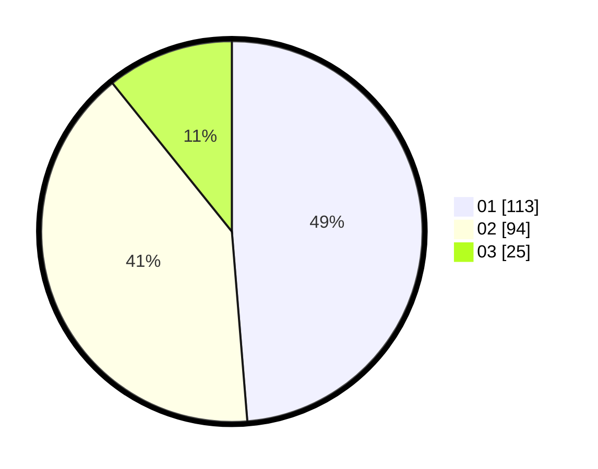

# Hasil

Hasil perolehan suara paslon dapat dilihat pada file paslon-01.txt, paslon-02.txt, dan paslon-03.txt.

Jika tidak ada, artinya data tersebut belum ada pada SIREKAP.

## Perolehan Suara

 * Paslon 01: **113**.
 * Paslon 02: **94**.
 * Paslon 03: **25**.

## Foto C Plano

https://sirekap-obj-formc.kpu.go.id/cab5/pemilu/ppwp/31/71/05/10/02/3171051002066-20240215-034104--162ac857-684c-4f15-9ecf-c258c148e32c.jpg

https://sirekap-obj-formc.kpu.go.id/cab5/pemilu/ppwp/31/71/05/10/02/3171051002066-20240215-021118--cd5c9757-12c9-49c2-bb9c-c530a950020d.jpg

https://sirekap-obj-formc.kpu.go.id/cab5/pemilu/ppwp/31/71/05/10/02/3171051002066-20240215-021123--b1d0c914-9569-4f17-91df-9c631fef9487.jpg

## DATA PEMILIH TETAP

Jumlah pemilih dalam DPT: **273**.
 * L: **142**.
 * P: **131**.

## DATA PENGGUNA HAK PILIH

Jumlah pengguna hak pilih dalam DPT: **225**.
 * L: **116**.
 * P: **109**.

Jumlah pengguna hak pilih dalam DPTb: **13**.
 * L: **4**.
 * P: **9**.

Jumlah pengguna hak pilih dalam DPK: **0**.
 * L: **0**.
 * P: **0**.

Jumlah pengguna hak pilih: **238**.
 * L: **120**.
 * P: **118**.

## JUMLAH SUARA SAH DAN TIDAK SAH

JUMLAH SELURUH SUARA SAH: **232**.

JUMLAH SUARA TIDAK SAH: **6**.

JUMLAH SELURUH SUARA SAH DAN SUARA TIDAK SAH: **238**.
