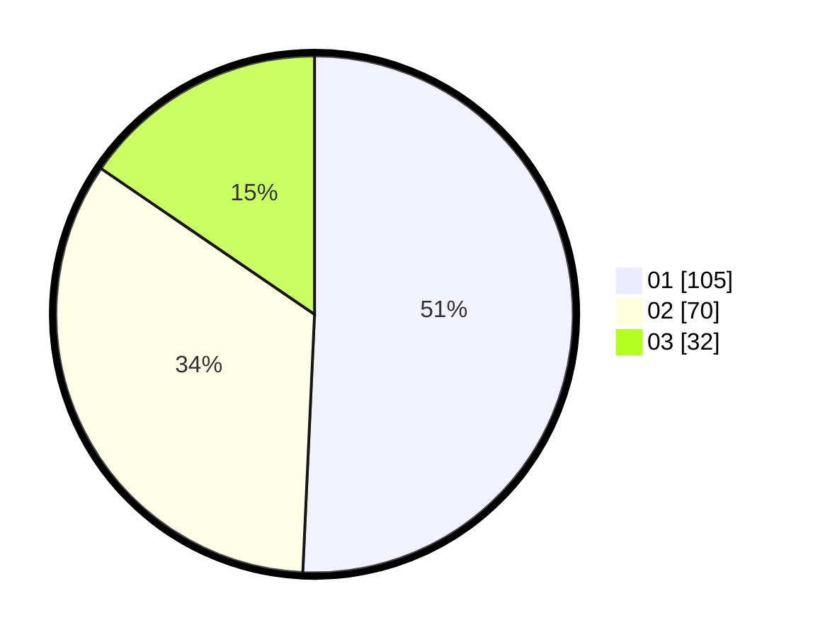

# Hasil

Hasil perolehan suara paslon dapat dilihat pada file paslon-01.txt, paslon-02.txt, dan paslon-03.txt.

Jika tidak ada, artinya data tersebut belum ada pada SIREKAP.

## Perolehan Suara

 * Paslon 01: **105**.
 * Paslon 02: **70**.
 * Paslon 03: **32**.

## Foto C Plano

https://sirekap-obj-formc.kpu.go.id/7849/pemilu/ppwp/31/71/05/10/02/3171051002068-20240215-234701--12aeeb8b-031e-48f3-b66a-bb023fdab0a6.jpg

https://sirekap-obj-formc.kpu.go.id/7849/pemilu/ppwp/31/71/05/10/02/3171051002068-20240215-234705--0532a04a-4130-46a3-b644-642c5aca8579.jpg

https://sirekap-obj-formc.kpu.go.id/7849/pemilu/ppwp/31/71/05/10/02/3171051002068-20240215-234704--3e15ac2f-1e5f-4b32-ae7a-c61f1bd4d467.jpg

## DATA PEMILIH TETAP

Jumlah pemilih dalam DPT: **265**.
 * L: **125**.
 * P: **140**.

## DATA PENGGUNA HAK PILIH

Jumlah pengguna hak pilih dalam DPT: **206**.
 * L: **92**.
 * P: **114**.

Jumlah pengguna hak pilih dalam DPTb: **5**.
 * L: **3**.
 * P: **2**.

Jumlah pengguna hak pilih dalam DPK: **0**.
 * L: **0**.
 * P: **0**.

Jumlah pengguna hak pilih: **211**.
 * L: **95**.
 * P: **116**.

## JUMLAH SUARA SAH DAN TIDAK SAH

JUMLAH SELURUH SUARA SAH: **207**.

JUMLAH SUARA TIDAK SAH: **4**.

JUMLAH SELURUH SUARA SAH DAN SUARA TIDAK SAH: **211**.
