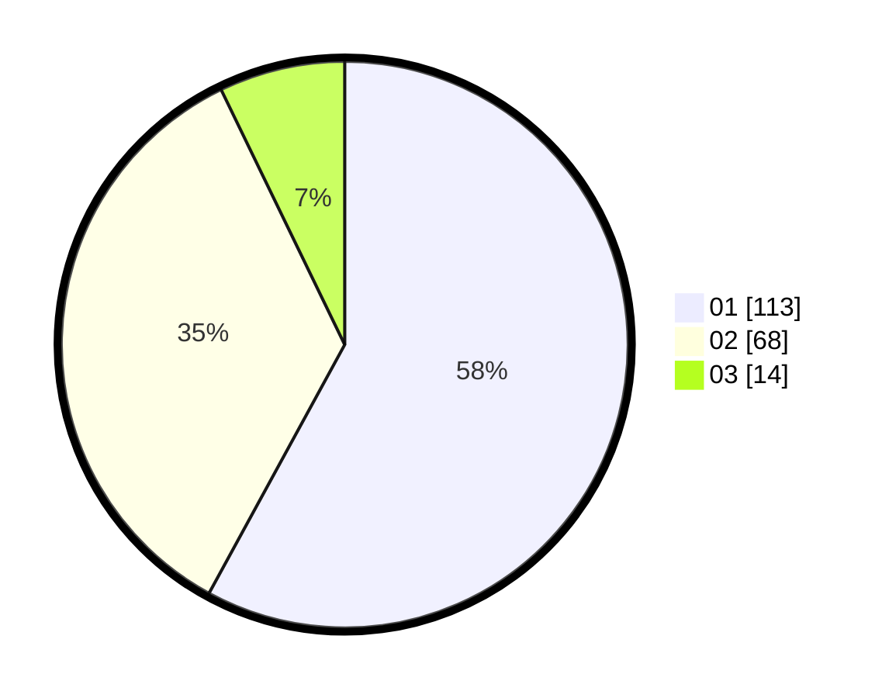

# Hasil

Hasil perolehan suara paslon dapat dilihat pada file paslon-01.txt, paslon-02.txt, dan paslon-03.txt.

Jika tidak ada, artinya data tersebut belum ada pada SIREKAP.

## Perolehan Suara

 * Paslon 01: **113**.
 * Paslon 02: **68**.
 * Paslon 03: **14**.

## Foto C Plano

https://sirekap-obj-formc.kpu.go.id/056b/pemilu/ppwp/31/71/05/10/02/3171051002072-20240214-212325--668ac4a3-24a6-4319-927a-ab008b764f10.jpg

https://sirekap-obj-formc.kpu.go.id/056b/pemilu/ppwp/31/71/05/10/02/3171051002072-20240215-000435--25232019-dc6a-4ec7-990a-755d76429d01.jpg

https://sirekap-obj-formc.kpu.go.id/056b/pemilu/ppwp/31/71/05/10/02/3171051002072-20240215-000523--67dcdded-d712-423f-a027-60554b6eeb3b.jpg

## DATA PEMILIH TETAP

Jumlah pemilih dalam DPT: **280**.
 * L: **133**.
 * P: **147**.

## DATA PENGGUNA HAK PILIH

Jumlah pengguna hak pilih dalam DPT: **195**.
 * L: **87**.
 * P: **108**.

Jumlah pengguna hak pilih dalam DPTb: **0**.
 * L: **0**.
 * P: **0**.

Jumlah pengguna hak pilih dalam DPK: **1**.
 * L: **0**.
 * P: **1**.

Jumlah pengguna hak pilih: **196**.
 * L: **87**.
 * P: **109**.

## JUMLAH SUARA SAH DAN TIDAK SAH

JUMLAH SELURUH SUARA SAH: **195**.

JUMLAH SUARA TIDAK SAH: **1**.

JUMLAH SELURUH SUARA SAH DAN SUARA TIDAK SAH: **196**.
