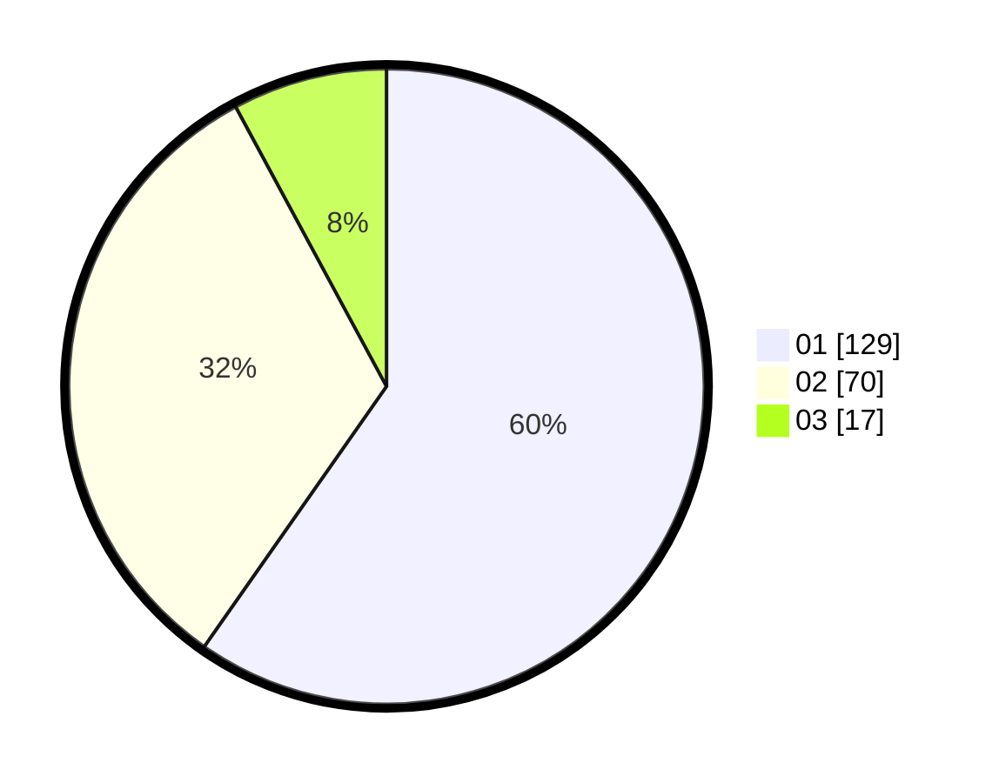

# Hasil

Hasil perolehan suara paslon dapat dilihat pada file paslon-01.txt, paslon-02.txt, dan paslon-03.txt.

Jika tidak ada, artinya data tersebut belum ada pada SIREKAP.

## Perolehan Suara

 * Paslon 01: **129**.
 * Paslon 02: **70**.
 * Paslon 03: **17**.

## Foto C Plano

https://sirekap-obj-formc.kpu.go.id/e6db/pemilu/ppwp/31/71/05/10/02/3171051002073-20240216-131839--631c6e68-f0ed-4ed7-a588-50019d9262bb.jpg

https://sirekap-obj-formc.kpu.go.id/e6db/pemilu/ppwp/31/71/05/10/02/3171051002073-20240216-131840--b6281cda-f622-4120-b295-e7bb237b6320.jpg

https://sirekap-obj-formc.kpu.go.id/e6db/pemilu/ppwp/31/71/05/10/02/3171051002073-20240214-192412--28357628-c3bb-4aa9-b5ff-9545a499ff6f.jpg

## DATA PEMILIH TETAP

Jumlah pemilih dalam DPT: **278**.
 * L: **141**.
 * P: **137**.

## DATA PENGGUNA HAK PILIH

Jumlah pengguna hak pilih dalam DPT: **217**.
 * L: **110**.
 * P: **107**.

Jumlah pengguna hak pilih dalam DPTb: **0**.
 * L: **0**.
 * P: **0**.

Jumlah pengguna hak pilih dalam DPK: **3**.
 * L: **0**.
 * P: **3**.

Jumlah pengguna hak pilih: **220**.
 * L: **110**.
 * P: **110**.

## JUMLAH SUARA SAH DAN TIDAK SAH

JUMLAH SELURUH SUARA SAH: **216**.

JUMLAH SUARA TIDAK SAH: **4**.

JUMLAH SELURUH SUARA SAH DAN SUARA TIDAK SAH: **220**.
