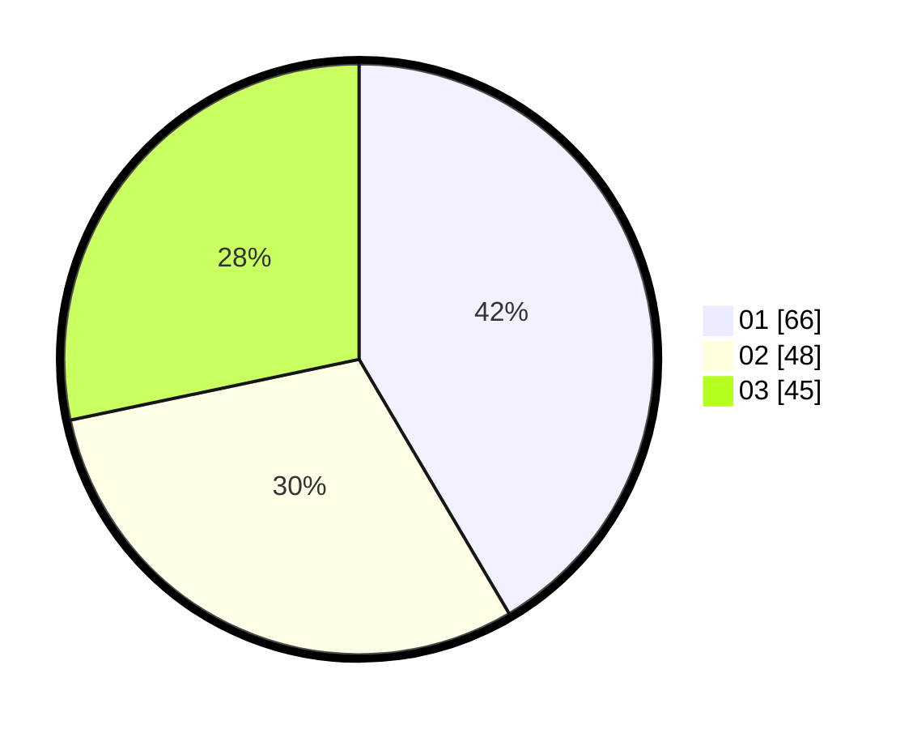

# Hasil

Hasil perolehan suara paslon dapat dilihat pada file paslon-01.txt, paslon-02.txt, dan paslon-03.txt.

Jika tidak ada, artinya data tersebut belum ada pada SIREKAP.

## Perolehan Suara

 * Paslon 01: **66**.
 * Paslon 02: **48**.
 * Paslon 03: **45**.

## Foto C Plano

https://sirekap-obj-formc.kpu.go.id/a81d/pemilu/ppwp/31/71/05/10/02/3171051002075-20240216-023915--e62e0fc6-b1ec-4f73-9fb7-4818734cdf6c.jpg

https://sirekap-obj-formc.kpu.go.id/a81d/pemilu/ppwp/31/71/05/10/02/3171051002075-20240216-023916--2e10a12f-ee92-485f-b984-e83caac08d51.jpg

https://sirekap-obj-formc.kpu.go.id/a81d/pemilu/ppwp/31/71/05/10/02/3171051002075-20240216-023916--6995243d-4a7c-4bac-9675-b6c847ede1d4.jpg

## DATA PEMILIH TETAP

Jumlah pemilih dalam DPT: **276**.
 * L: **137**.
 * P: **139**.

## DATA PENGGUNA HAK PILIH

Jumlah pengguna hak pilih dalam DPT: **160**.
 * L: **69**.
 * P: **91**.

Jumlah pengguna hak pilih dalam DPTb: **2**.
 * L: **2**.
 * P: **0**.

Jumlah pengguna hak pilih dalam DPK: **0**.
 * L: **0**.
 * P: **0**.

Jumlah pengguna hak pilih: **162**.
 * L: **71**.
 * P: **91**.

## JUMLAH SUARA SAH DAN TIDAK SAH

JUMLAH SELURUH SUARA SAH: **159**.

JUMLAH SUARA TIDAK SAH: **3**.

JUMLAH SELURUH SUARA SAH DAN SUARA TIDAK SAH: **162**.
