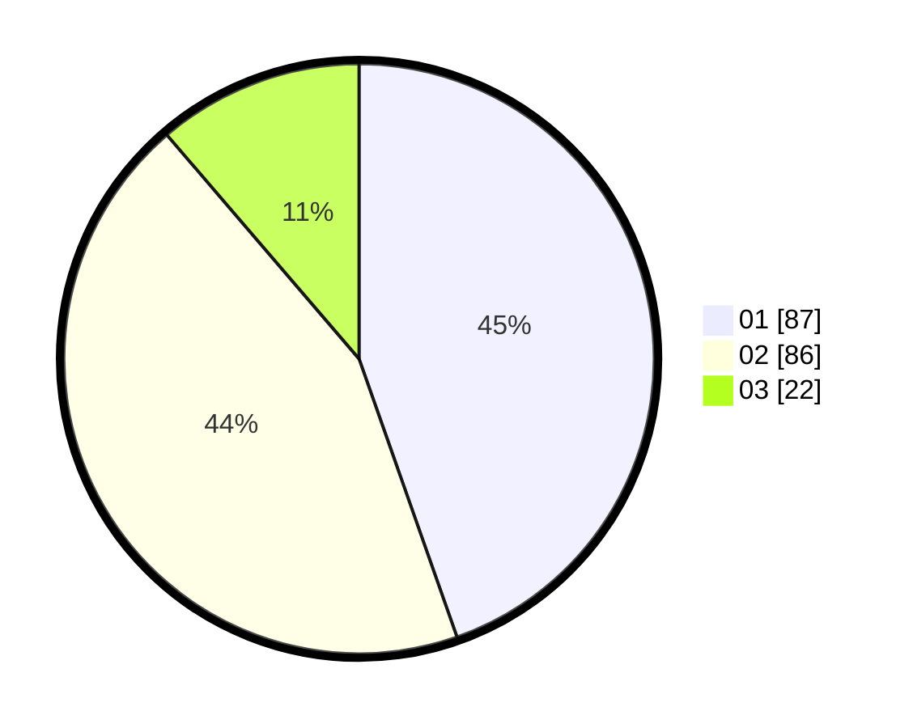

# Hasil

Hasil perolehan suara paslon dapat dilihat pada file paslon-01.txt, paslon-02.txt, dan paslon-03.txt.

Jika tidak ada, artinya data tersebut belum ada pada SIREKAP.

## Perolehan Suara

 * Paslon 01: **87**.
 * Paslon 02: **86**.
 * Paslon 03: **22**.

## Foto C Plano

https://sirekap-obj-formc.kpu.go.id/8ef8/pemilu/ppwp/31/71/05/10/02/3171051002080-20240215-002028--c462b300-bcee-450d-b79a-a2660f3a9a62.jpg

https://sirekap-obj-formc.kpu.go.id/8ef8/pemilu/ppwp/31/71/05/10/02/3171051002080-20240215-002159--35dc3a3c-4dd4-4eb2-a012-f1625bf77838.jpg

https://sirekap-obj-formc.kpu.go.id/8ef8/pemilu/ppwp/31/71/05/10/02/3171051002080-20240215-003103--ed8cbd6a-1bef-430c-9222-235facad3f74.jpg

## DATA PEMILIH TETAP

Jumlah pemilih dalam DPT: **264**.
 * L: **115**.
 * P: **149**.

## DATA PENGGUNA HAK PILIH

Jumlah pengguna hak pilih dalam DPT: **196**.
 * L: **79**.
 * P: **117**.

Jumlah pengguna hak pilih dalam DPTb: **0**.
 * L: **0**.
 * P: **0**.

Jumlah pengguna hak pilih dalam DPK: **2**.
 * L: **1**.
 * P: **1**.

Jumlah pengguna hak pilih: **198**.
 * L: **80**.
 * P: **118**.

## JUMLAH SUARA SAH DAN TIDAK SAH

JUMLAH SELURUH SUARA SAH: **195**.

JUMLAH SUARA TIDAK SAH: **3**.

JUMLAH SELURUH SUARA SAH DAN SUARA TIDAK SAH: **198**.
