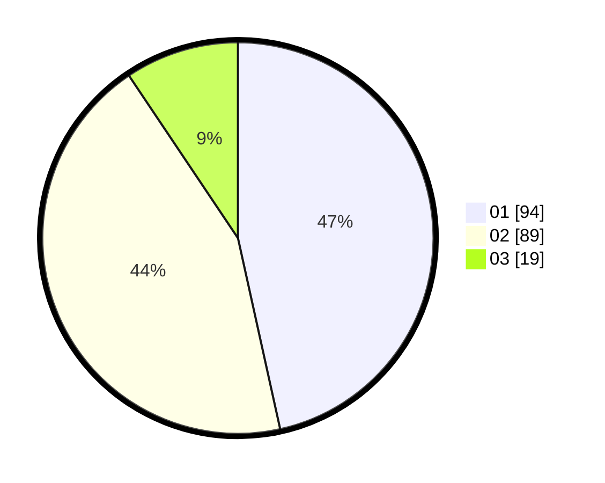

# Hasil

Hasil perolehan suara paslon dapat dilihat pada file paslon-01.txt, paslon-02.txt, dan paslon-03.txt.

Jika tidak ada, artinya data tersebut belum ada pada SIREKAP.

## Perolehan Suara

 * Paslon 01: **94**.
 * Paslon 02: **89**.
 * Paslon 03: **19**.

## Foto C Plano

https://sirekap-obj-formc.kpu.go.id/e682/pemilu/ppwp/31/71/05/10/02/3171051002081-20240214-190733--5ec61f7d-95ef-4b1f-833a-b6969b58e2af.jpg

https://sirekap-obj-formc.kpu.go.id/e682/pemilu/ppwp/31/71/05/10/02/3171051002081-20240214-191857--16625fe6-68db-47be-aa45-77de85f2039f.jpg

https://sirekap-obj-formc.kpu.go.id/e682/pemilu/ppwp/31/71/05/10/02/3171051002081-20240214-191328--2aea53fb-cfa9-4edf-9083-7e0781c488a3.jpg

## DATA PEMILIH TETAP

Jumlah pemilih dalam DPT: **265**.
 * L: **133**.
 * P: **132**.

## DATA PENGGUNA HAK PILIH

Jumlah pengguna hak pilih dalam DPT: **205**.
 * L: **103**.
 * P: **102**.

Jumlah pengguna hak pilih dalam DPTb: **1**.
 * L: **0**.
 * P: **1**.

Jumlah pengguna hak pilih dalam DPK: **2**.
 * L: **1**.
 * P: **1**.

Jumlah pengguna hak pilih: **208**.
 * L: **104**.
 * P: **104**.

## JUMLAH SUARA SAH DAN TIDAK SAH

JUMLAH SELURUH SUARA SAH: **202**.

JUMLAH SUARA TIDAK SAH: **6**.

JUMLAH SELURUH SUARA SAH DAN SUARA TIDAK SAH: **208**.
