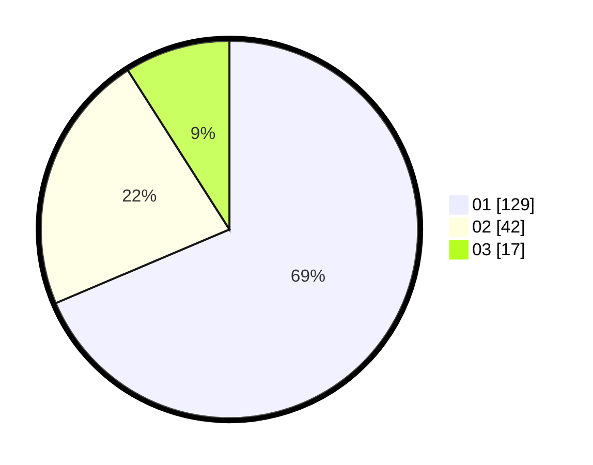

# Hasil

Hasil perolehan suara paslon dapat dilihat pada file paslon-01.txt, paslon-02.txt, dan paslon-03.txt.

Jika tidak ada, artinya data tersebut belum ada pada SIREKAP.

## Perolehan Suara

 * Paslon 01: **129**.
 * Paslon 02: **42**.
 * Paslon 03: **17**.

## Foto C Plano

https://sirekap-obj-formc.kpu.go.id/74a0/pemilu/ppwp/31/71/05/10/02/3171051002089-20240214-213745--5bed1744-db43-487f-b62f-d423963c1757.jpg

https://sirekap-obj-formc.kpu.go.id/74a0/pemilu/ppwp/31/71/05/10/02/3171051002089-20240214-213810--8b26fbbd-e52c-47a0-8010-7c7a365fc5ef.jpg

https://sirekap-obj-formc.kpu.go.id/74a0/pemilu/ppwp/31/71/05/10/02/3171051002089-20240214-213839--4d82e9b2-c4c3-4c72-a166-4dd95f180797.jpg

## DATA PEMILIH TETAP

Jumlah pemilih dalam DPT: **255**.
 * L: **126**.
 * P: **129**.

## DATA PENGGUNA HAK PILIH

Jumlah pengguna hak pilih dalam DPT: **188**.
 * L: **91**.
 * P: **97**.

Jumlah pengguna hak pilih dalam DPTb: **4**.
 * L: **2**.
 * P: **2**.

Jumlah pengguna hak pilih dalam DPK: **0**.
 * L: **0**.
 * P: **0**.

Jumlah pengguna hak pilih: **192**.
 * L: **93**.
 * P: **99**.

## JUMLAH SUARA SAH DAN TIDAK SAH

JUMLAH SELURUH SUARA SAH: **188**.

JUMLAH SUARA TIDAK SAH: **4**.

JUMLAH SELURUH SUARA SAH DAN SUARA TIDAK SAH: **192**.
