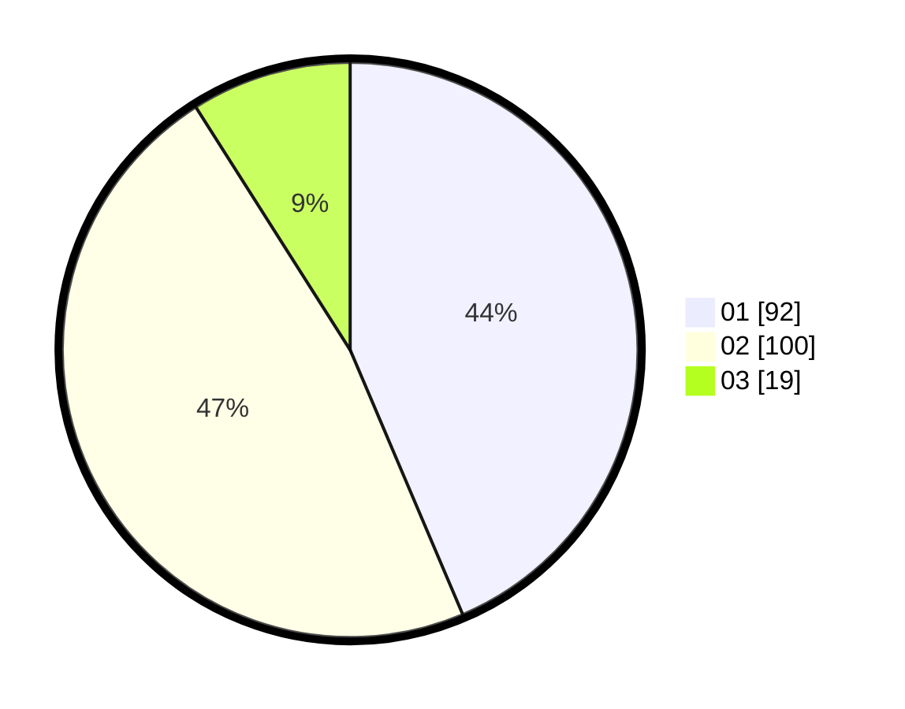

# Hasil

Hasil perolehan suara paslon dapat dilihat pada file paslon-01.txt, paslon-02.txt, dan paslon-03.txt.

Jika tidak ada, artinya data tersebut belum ada pada SIREKAP.

## Perolehan Suara

 * Paslon 01: **92**.
 * Paslon 02: **100**.
 * Paslon 03: **19**.

## Foto C Plano

https://sirekap-obj-formc.kpu.go.id/43a5/pemilu/ppwp/31/71/05/10/02/3171051002091-20240215-032229--d6c0430c-e469-48c9-af52-fe3ae041346d.jpg

https://sirekap-obj-formc.kpu.go.id/43a5/pemilu/ppwp/31/71/05/10/02/3171051002091-20240215-032534--b9c8633d-a395-45a8-9bfc-45f0a62dbe09.jpg

https://sirekap-obj-formc.kpu.go.id/43a5/pemilu/ppwp/31/71/05/10/02/3171051002091-20240215-032627--5b1c1f63-bd12-4ffa-ae65-1a153bd02a41.jpg

## DATA PEMILIH TETAP

Jumlah pemilih dalam DPT: **252**.
 * L: **127**.
 * P: **125**.

## DATA PENGGUNA HAK PILIH

Jumlah pengguna hak pilih dalam DPT: **213**.
 * L: **102**.
 * P: **111**.

Jumlah pengguna hak pilih dalam DPTb: **0**.
 * L: **0**.
 * P: **0**.

Jumlah pengguna hak pilih dalam DPK: **2**.
 * L: **0**.
 * P: **2**.

Jumlah pengguna hak pilih: **215**.
 * L: **102**.
 * P: **113**.

## JUMLAH SUARA SAH DAN TIDAK SAH

JUMLAH SELURUH SUARA SAH: **211**.

JUMLAH SUARA TIDAK SAH: **4**.

JUMLAH SELURUH SUARA SAH DAN SUARA TIDAK SAH: **215**.
