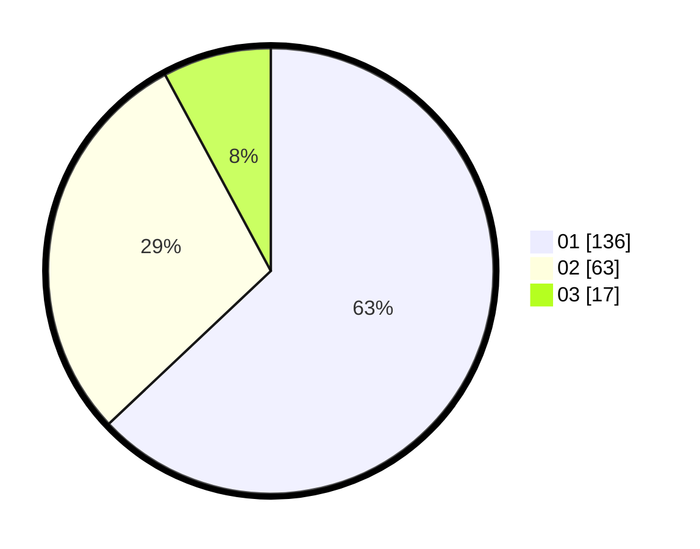

# Hasil

Hasil perolehan suara paslon dapat dilihat pada file paslon-01.txt, paslon-02.txt, dan paslon-03.txt.

Jika tidak ada, artinya data tersebut belum ada pada SIREKAP.

## Perolehan Suara

 * Paslon 01: **136**.
 * Paslon 02: **63**.
 * Paslon 03: **17**.

## Foto C Plano

https://sirekap-obj-formc.kpu.go.id/3c2f/pemilu/ppwp/31/71/05/10/02/3171051002096-20240216-025810--410deec3-eedc-42bf-9c59-c8afd83e83a3.jpg

https://sirekap-obj-formc.kpu.go.id/3c2f/pemilu/ppwp/31/71/05/10/02/3171051002096-20240216-025811--31d630b5-9918-4d8f-840a-f85f366687f8.jpg

https://sirekap-obj-formc.kpu.go.id/3c2f/pemilu/ppwp/31/71/05/10/02/3171051002096-20240216-025810--b86daed5-a148-4f49-82c1-b81261f468a5.jpg

## DATA PEMILIH TETAP

Jumlah pemilih dalam DPT: **276**.
 * L: **137**.
 * P: **139**.

## DATA PENGGUNA HAK PILIH

Jumlah pengguna hak pilih dalam DPT: **201**.
 * L: **97**.
 * P: **104**.

Jumlah pengguna hak pilih dalam DPTb: **2**.
 * L: **0**.
 * P: **2**.

Jumlah pengguna hak pilih dalam DPK: **13**.
 * L: **7**.
 * P: **6**.

Jumlah pengguna hak pilih: **216**.
 * L: **104**.
 * P: **112**.

## JUMLAH SUARA SAH DAN TIDAK SAH

JUMLAH SELURUH SUARA SAH: **216**.

JUMLAH SUARA TIDAK SAH: **4**.

JUMLAH SELURUH SUARA SAH DAN SUARA TIDAK SAH: **220**.
