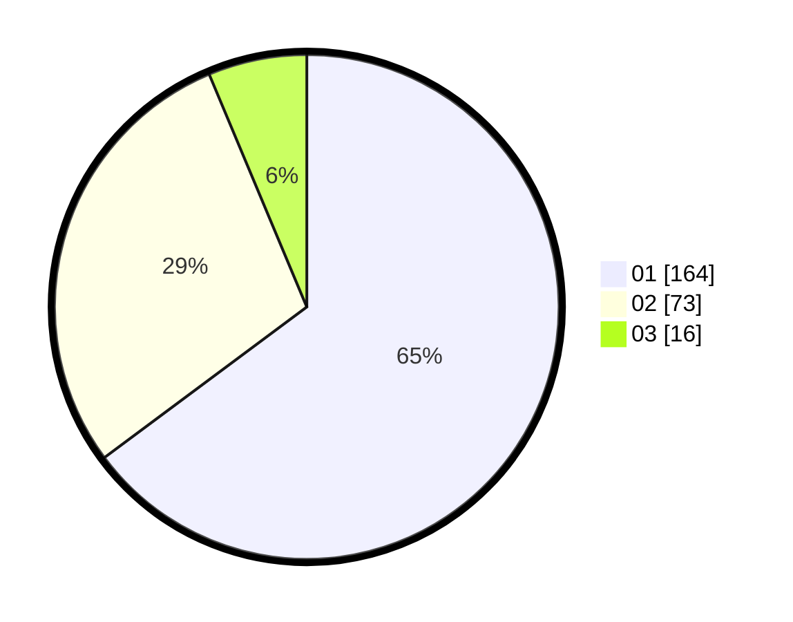

# Hasil

Hasil perolehan suara paslon dapat dilihat pada file paslon-01.txt, paslon-02.txt, dan paslon-03.txt.

Jika tidak ada, artinya data tersebut belum ada pada SIREKAP.

## Perolehan Suara

 * Paslon 01: **164**.
 * Paslon 02: **73**.
 * Paslon 03: **16**.

## Foto C Plano

https://sirekap-obj-formc.kpu.go.id/dc10/pemilu/ppwp/31/71/05/10/02/3171051002098-20240216-020616--869afe96-38c6-4717-b79b-6da2a4c7d145.jpg

https://sirekap-obj-formc.kpu.go.id/dc10/pemilu/ppwp/31/71/05/10/02/3171051002098-20240216-020618--267b5eb5-7850-49f0-b01f-dd464c8b8e75.jpg

https://sirekap-obj-formc.kpu.go.id/dc10/pemilu/ppwp/31/71/05/10/02/3171051002098-20240216-020617--8954aade-f80b-4ed2-a20f-1f83c2e25c56.jpg

## DATA PEMILIH TETAP

Jumlah pemilih dalam DPT: **288**.
 * L: **144**.
 * P: **144**.

## DATA PENGGUNA HAK PILIH

Jumlah pengguna hak pilih dalam DPT: **227**.
 * L: **110**.
 * P: **117**.

Jumlah pengguna hak pilih dalam DPTb: **1**.
 * L: **1**.
 * P: **0**.

Jumlah pengguna hak pilih dalam DPK: **26**.
 * L: **14**.
 * P: **12**.

Jumlah pengguna hak pilih: **254**.
 * L: **125**.
 * P: **129**.

## JUMLAH SUARA SAH DAN TIDAK SAH

JUMLAH SELURUH SUARA SAH: **253**.

JUMLAH SUARA TIDAK SAH: **1**.

JUMLAH SELURUH SUARA SAH DAN SUARA TIDAK SAH: **254**.
