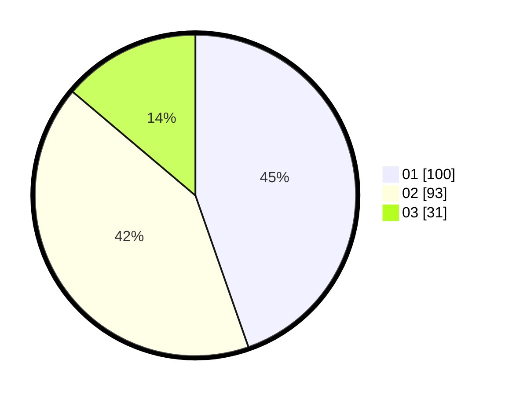

# Hasil

Hasil perolehan suara paslon dapat dilihat pada file paslon-01.txt, paslon-02.txt, dan paslon-03.txt.

Jika tidak ada, artinya data tersebut belum ada pada SIREKAP.

## Perolehan Suara

 * Paslon 01: **100**.
 * Paslon 02: **93**.
 * Paslon 03: **31**.

## Foto C Plano

https://sirekap-obj-formc.kpu.go.id/20bc/pemilu/ppwp/31/71/05/10/02/3171051002100-20240215-234107--f885564e-0a2e-4bfd-bd4f-63146d8dab73.jpg

https://sirekap-obj-formc.kpu.go.id/20bc/pemilu/ppwp/31/71/05/10/02/3171051002100-20240215-234113--b78156dc-2b97-45ef-b7fe-4792e1f4b6b1.jpg

https://sirekap-obj-formc.kpu.go.id/20bc/pemilu/ppwp/31/71/05/10/02/3171051002100-20240215-234111--3cc1fc47-a8e7-45cb-b8ad-31e3dc5d9b57.jpg

## DATA PEMILIH TETAP

Jumlah pemilih dalam DPT: **280**.
 * L: **139**.
 * P: **141**.

## DATA PENGGUNA HAK PILIH

Jumlah pengguna hak pilih dalam DPT: **225**.
 * L: **108**.
 * P: **117**.

Jumlah pengguna hak pilih dalam DPTb: **0**.
 * L: **0**.
 * P: **0**.

Jumlah pengguna hak pilih dalam DPK: **4**.
 * L: **2**.
 * P: **2**.

Jumlah pengguna hak pilih: **229**.
 * L: **110**.
 * P: **119**.

## JUMLAH SUARA SAH DAN TIDAK SAH

JUMLAH SELURUH SUARA SAH: **224**.

JUMLAH SUARA TIDAK SAH: **5**.

JUMLAH SELURUH SUARA SAH DAN SUARA TIDAK SAH: **229**.
