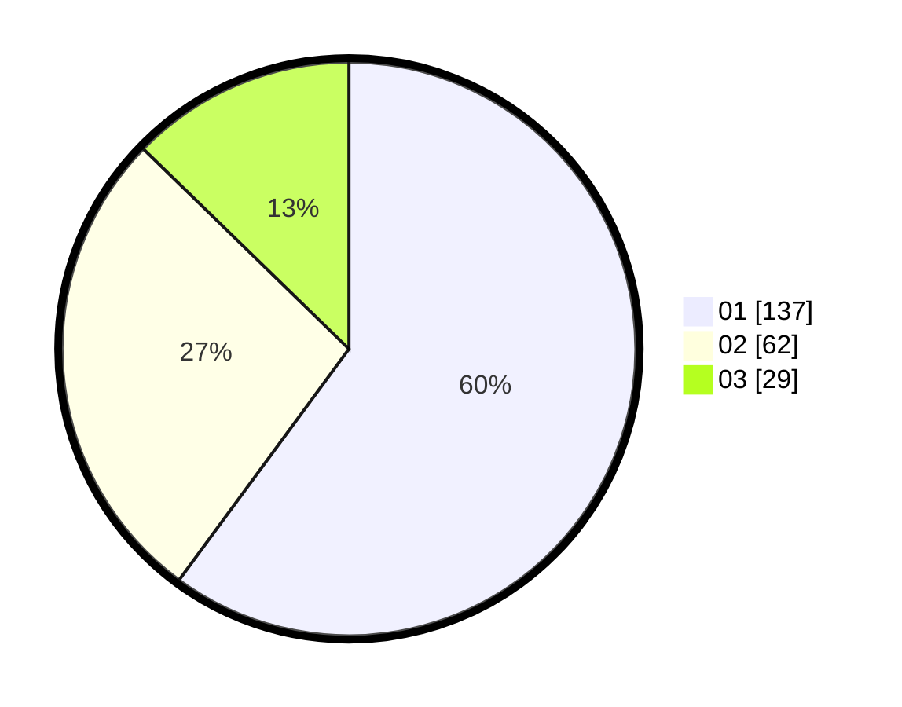

# Hasil

Hasil perolehan suara paslon dapat dilihat pada file paslon-01.txt, paslon-02.txt, dan paslon-03.txt.

Jika tidak ada, artinya data tersebut belum ada pada SIREKAP.

## Perolehan Suara

 * Paslon 01: **137**.
 * Paslon 02: **62**.
 * Paslon 03: **29**.

## Foto C Plano

https://sirekap-obj-formc.kpu.go.id/4d24/pemilu/ppwp/31/71/05/10/02/3171051002114-20240215-003007--ea50798e-a1e0-4530-bb75-04a96d444219.jpg

https://sirekap-obj-formc.kpu.go.id/4d24/pemilu/ppwp/31/71/05/10/02/3171051002114-20240215-003108--794ae064-8296-460c-9e67-9f2bf7f25c29.jpg

https://sirekap-obj-formc.kpu.go.id/4d24/pemilu/ppwp/31/71/05/10/02/3171051002114-20240215-003208--f50b6a87-775e-41ae-b38e-42aa24eb2286.jpg

## DATA PEMILIH TETAP

Jumlah pemilih dalam DPT: **278**.
 * L: **144**.
 * P: **134**.

## DATA PENGGUNA HAK PILIH

Jumlah pengguna hak pilih dalam DPT: **228**.
 * L: **115**.
 * P: **113**.

Jumlah pengguna hak pilih dalam DPTb: **0**.
 * L: **0**.
 * P: **0**.

Jumlah pengguna hak pilih dalam DPK: **4**.
 * L: **2**.
 * P: **2**.

Jumlah pengguna hak pilih: **232**.
 * L: **117**.
 * P: **115**.

## JUMLAH SUARA SAH DAN TIDAK SAH

JUMLAH SELURUH SUARA SAH: **228**.

JUMLAH SUARA TIDAK SAH: **4**.

JUMLAH SELURUH SUARA SAH DAN SUARA TIDAK SAH: **232**.
