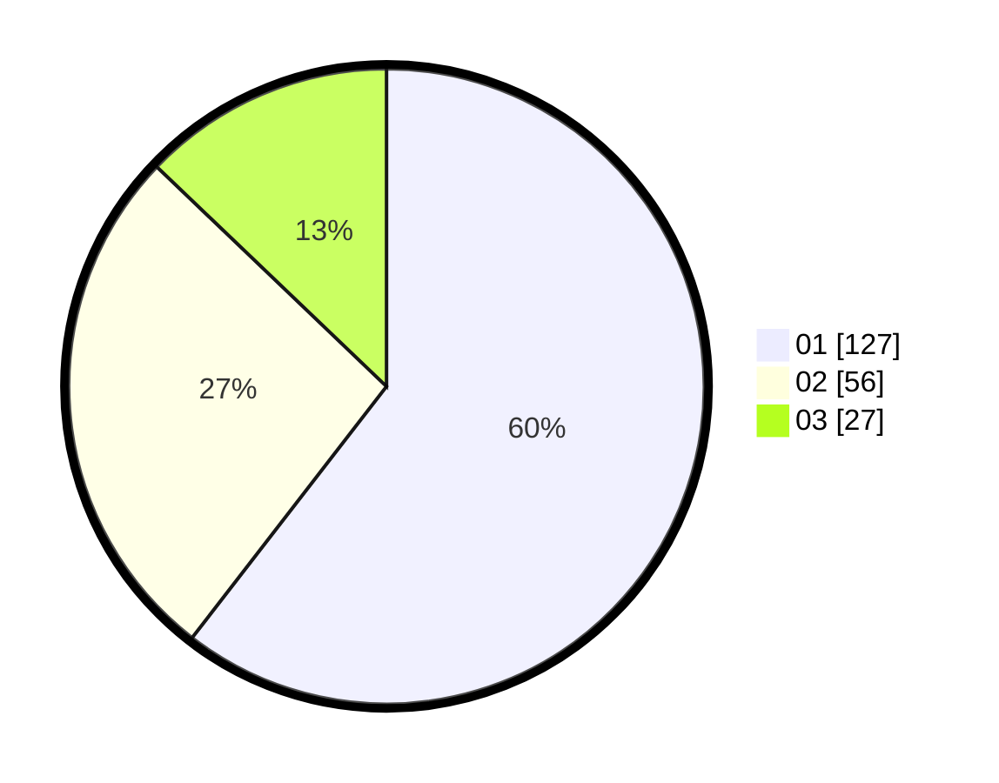

# Hasil

Hasil perolehan suara paslon dapat dilihat pada file paslon-01.txt, paslon-02.txt, dan paslon-03.txt.

Jika tidak ada, artinya data tersebut belum ada pada SIREKAP.

## Perolehan Suara

 * Paslon 01: **127**.
 * Paslon 02: **56**.
 * Paslon 03: **27**.

## Foto C Plano

https://sirekap-obj-formc.kpu.go.id/65b4/pemilu/ppwp/31/71/05/10/02/3171051002115-20240216-143442--cfa105ae-f401-44fa-9ec3-18136b7f5626.jpg

https://sirekap-obj-formc.kpu.go.id/65b4/pemilu/ppwp/31/71/05/10/02/3171051002115-20240216-143443--122eadd4-f0a8-4758-831e-27619139e632.jpg

https://sirekap-obj-formc.kpu.go.id/65b4/pemilu/ppwp/31/71/05/10/02/3171051002115-20240216-143443--cb0f7333-ecd0-4d61-b896-b16e0323d7cd.jpg

## DATA PEMILIH TETAP

Jumlah pemilih dalam DPT: **0**.
 * L: **0**.
 * P: **0**.

## DATA PENGGUNA HAK PILIH

Jumlah pengguna hak pilih dalam DPT: **0**.
 * L: **0**.
 * P: **0**.

Jumlah pengguna hak pilih dalam DPTb: **0**.
 * L: **0**.
 * P: **0**.

Jumlah pengguna hak pilih dalam DPK: **0**.
 * L: **0**.
 * P: **0**.

Jumlah pengguna hak pilih: **0**.
 * L: **0**.
 * P: **0**.

## JUMLAH SUARA SAH DAN TIDAK SAH

JUMLAH SELURUH SUARA SAH: **210**.

JUMLAH SUARA TIDAK SAH: **2**.

JUMLAH SELURUH SUARA SAH DAN SUARA TIDAK SAH: **212**.
