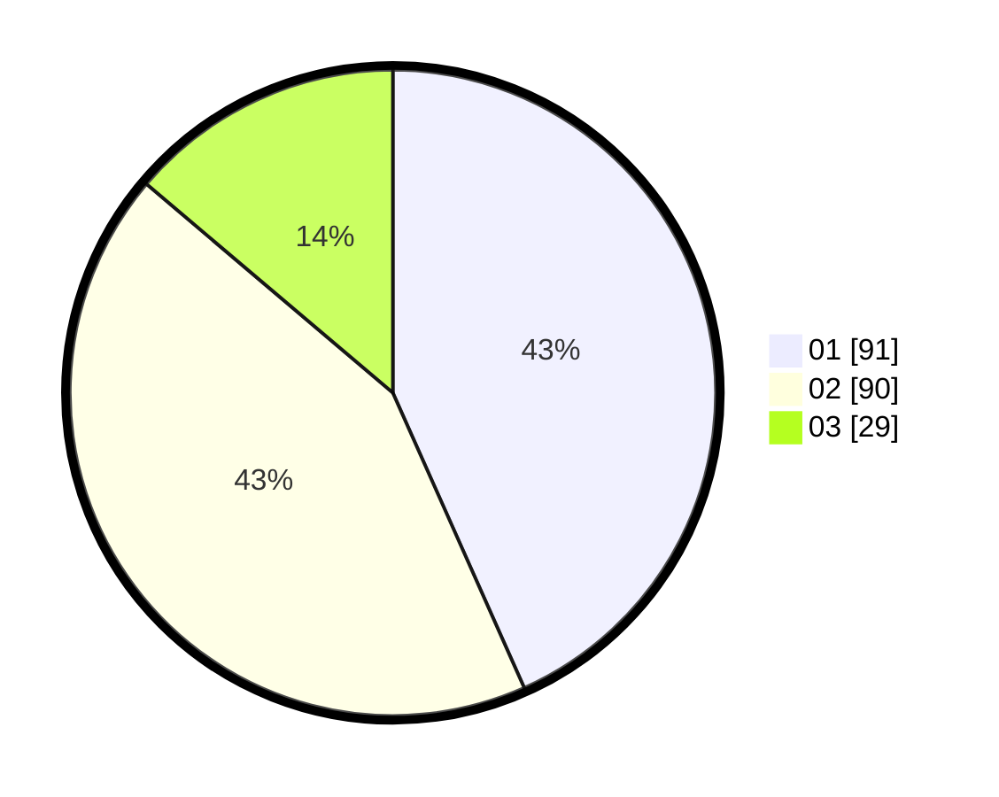

# Hasil

Hasil perolehan suara paslon dapat dilihat pada file paslon-01.txt, paslon-02.txt, dan paslon-03.txt.

Jika tidak ada, artinya data tersebut belum ada pada SIREKAP.

## Perolehan Suara

 * Paslon 01: **91**.
 * Paslon 02: **90**.
 * Paslon 03: **29**.

## Foto C Plano

https://sirekap-obj-formc.kpu.go.id/60c1/pemilu/ppwp/31/71/05/10/02/3171051002121-20240216-053947--e0840fa2-c832-4a0a-b04c-9961734fc421.jpg

https://sirekap-obj-formc.kpu.go.id/60c1/pemilu/ppwp/31/71/05/10/02/3171051002121-20240216-052427--9c892caa-c67e-42cd-a31a-45d0a4891c4e.jpg

https://sirekap-obj-formc.kpu.go.id/60c1/pemilu/ppwp/31/71/05/10/02/3171051002121-20240216-052421--5e715d83-5844-413f-b4b8-38befc3a45ba.jpg

## DATA PEMILIH TETAP

Jumlah pemilih dalam DPT: **280**.
 * L: **138**.
 * P: **142**.

## DATA PENGGUNA HAK PILIH

Jumlah pengguna hak pilih dalam DPT: **215**.
 * L: **97**.
 * P: **118**.

Jumlah pengguna hak pilih dalam DPTb: **0**.
 * L: **0**.
 * P: **0**.

Jumlah pengguna hak pilih dalam DPK: **2**.
 * L: **2**.
 * P: **0**.

Jumlah pengguna hak pilih: **218**.
 * L: **99**.
 * P: **119**.

## JUMLAH SUARA SAH DAN TIDAK SAH

JUMLAH SELURUH SUARA SAH: **210**.

JUMLAH SUARA TIDAK SAH: **8**.

JUMLAH SELURUH SUARA SAH DAN SUARA TIDAK SAH: **218**.
