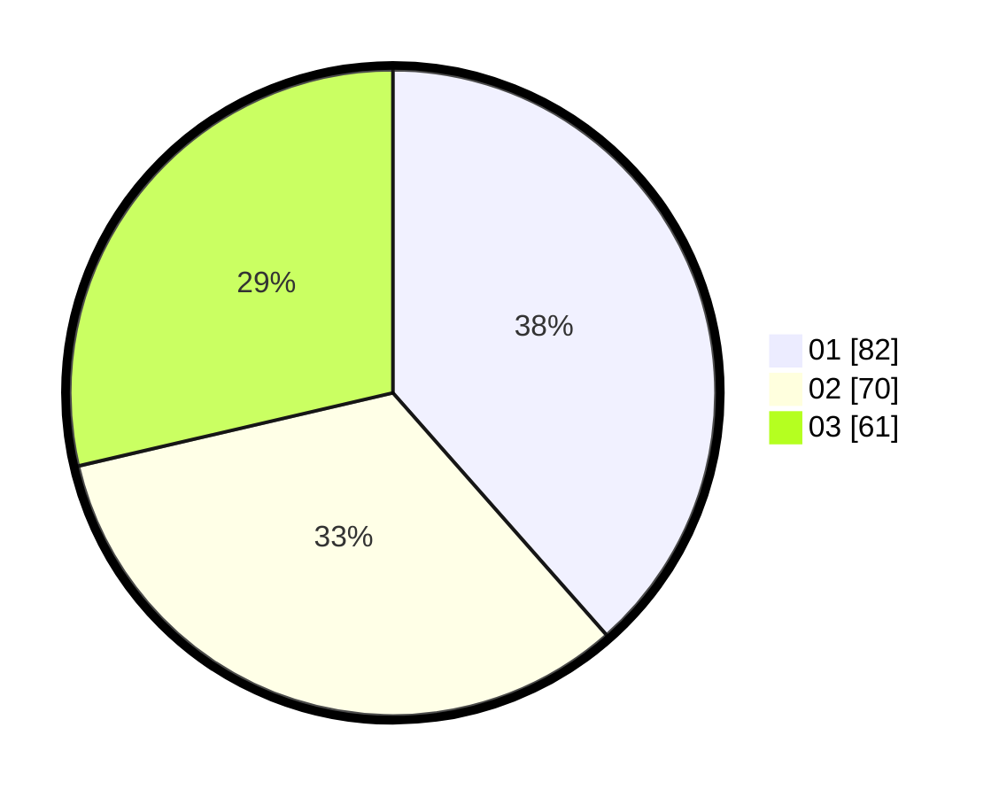

# Hasil

Hasil perolehan suara paslon dapat dilihat pada file paslon-01.txt, paslon-02.txt, dan paslon-03.txt.

Jika tidak ada, artinya data tersebut belum ada pada SIREKAP.

## Perolehan Suara

 * Paslon 01: **82**.
 * Paslon 02: **70**.
 * Paslon 03: **61**.

## Foto C Plano

https://sirekap-obj-formc.kpu.go.id/19fc/pemilu/ppwp/31/71/05/10/03/3171051003002-20240216-013828--770364a4-4136-4a22-9851-ad0ca7611d15.jpg

https://sirekap-obj-formc.kpu.go.id/19fc/pemilu/ppwp/31/71/05/10/03/3171051003002-20240216-011816--9cc0355c-11b6-443d-89b6-8c6a5b697ce7.jpg

https://sirekap-obj-formc.kpu.go.id/19fc/pemilu/ppwp/31/71/05/10/03/3171051003002-20240216-011813--b96ac157-26f2-4ff4-992e-98bd74b1b1c2.jpg

## DATA PEMILIH TETAP

Jumlah pemilih dalam DPT: **274**.
 * L: **133**.
 * P: **141**.

## DATA PENGGUNA HAK PILIH

Jumlah pengguna hak pilih dalam DPT: **203**.
 * L: **97**.
 * P: **106**.

Jumlah pengguna hak pilih dalam DPTb: **10**.
 * L: **6**.
 * P: **4**.

Jumlah pengguna hak pilih dalam DPK: **4**.
 * L: **1**.
 * P: **3**.

Jumlah pengguna hak pilih: **217**.
 * L: **104**.
 * P: **113**.

## JUMLAH SUARA SAH DAN TIDAK SAH

JUMLAH SELURUH SUARA SAH: **213**.

JUMLAH SUARA TIDAK SAH: **4**.

JUMLAH SELURUH SUARA SAH DAN SUARA TIDAK SAH: **217**.
