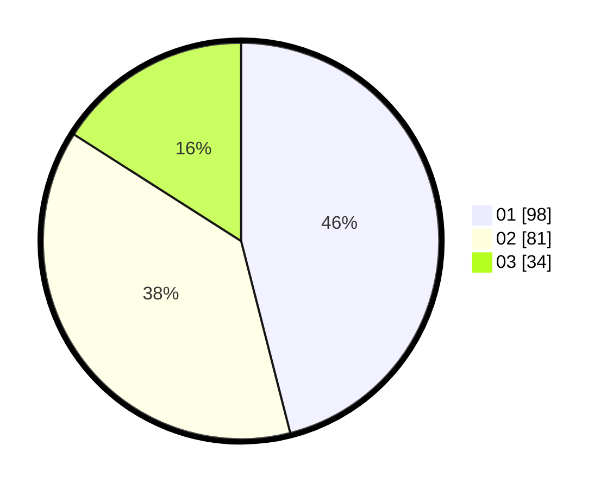

# Hasil

Hasil perolehan suara paslon dapat dilihat pada file paslon-01.txt, paslon-02.txt, dan paslon-03.txt.

Jika tidak ada, artinya data tersebut belum ada pada SIREKAP.

## Perolehan Suara

 * Paslon 01: **98**.
 * Paslon 02: **81**.
 * Paslon 03: **34**.

## Foto C Plano

https://sirekap-obj-formc.kpu.go.id/9449/pemilu/ppwp/31/71/05/10/03/3171051003012-20240216-125952--df8f5e80-4592-43b1-9c12-8f222f65fcbf.jpg

https://sirekap-obj-formc.kpu.go.id/9449/pemilu/ppwp/31/71/05/10/03/3171051003012-20240216-125959--5bb99c10-cfaf-4714-893a-17b11adf3614.jpg

https://sirekap-obj-formc.kpu.go.id/9449/pemilu/ppwp/31/71/05/10/03/3171051003012-20240216-125955--6156a408-c26e-4e15-be13-89e7cc536594.jpg

## DATA PEMILIH TETAP

Jumlah pemilih dalam DPT: **290**.
 * L: **150**.
 * P: **140**.

## DATA PENGGUNA HAK PILIH

Jumlah pengguna hak pilih dalam DPT: **214**.
 * L: **107**.
 * P: **107**.

Jumlah pengguna hak pilih dalam DPTb: **2**.
 * L: **1**.
 * P: **1**.

Jumlah pengguna hak pilih dalam DPK: **2**.
 * L: **0**.
 * P: **2**.

Jumlah pengguna hak pilih: **218**.
 * L: **108**.
 * P: **110**.

## JUMLAH SUARA SAH DAN TIDAK SAH

JUMLAH SELURUH SUARA SAH: **213**.

JUMLAH SUARA TIDAK SAH: **5**.

JUMLAH SELURUH SUARA SAH DAN SUARA TIDAK SAH: **218**.
