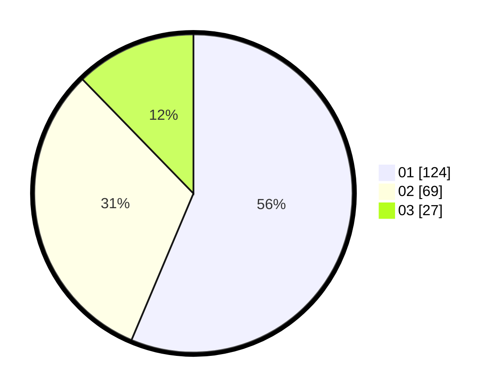

# Hasil

Hasil perolehan suara paslon dapat dilihat pada file paslon-01.txt, paslon-02.txt, dan paslon-03.txt.

Jika tidak ada, artinya data tersebut belum ada pada SIREKAP.

## Perolehan Suara

 * Paslon 01: **124**.
 * Paslon 02: **69**.
 * Paslon 03: **27**.

## Foto C Plano

https://sirekap-obj-formc.kpu.go.id/1624/pemilu/ppwp/31/71/05/10/03/3171051003024-20240214-224539--3c6d4cef-0067-4b05-94a5-e69e0db25cb3.jpg

https://sirekap-obj-formc.kpu.go.id/1624/pemilu/ppwp/31/71/05/10/03/3171051003024-20240215-014212--90214df0-ad31-4551-857c-118b04c6c4e5.jpg

https://sirekap-obj-formc.kpu.go.id/1624/pemilu/ppwp/31/71/05/10/03/3171051003024-20240215-014041--df9a4b3e-7c58-4279-95b3-5e14a30e9c81.jpg

## DATA PEMILIH TETAP

Jumlah pemilih dalam DPT: **270**.
 * L: **114**.
 * P: **156**.

## DATA PENGGUNA HAK PILIH

Jumlah pengguna hak pilih dalam DPT: **221**.
 * L: **94**.
 * P: **127**.

Jumlah pengguna hak pilih dalam DPTb: **17**.
 * L: **7**.
 * P: **10**.

Jumlah pengguna hak pilih dalam DPK: **1**.
 * L: **1**.
 * P: **0**.

Jumlah pengguna hak pilih: **239**.
 * L: **102**.
 * P: **137**.

## JUMLAH SUARA SAH DAN TIDAK SAH

JUMLAH SELURUH SUARA SAH: **220**.

JUMLAH SUARA TIDAK SAH: **1**.

JUMLAH SELURUH SUARA SAH DAN SUARA TIDAK SAH: **221**.
